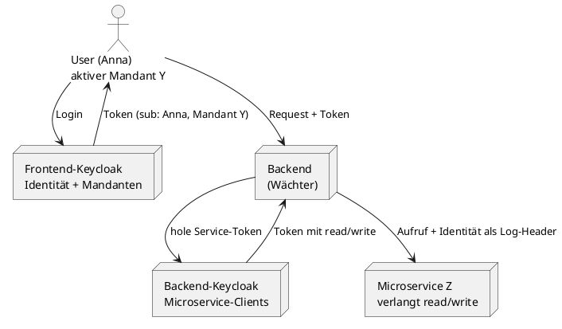
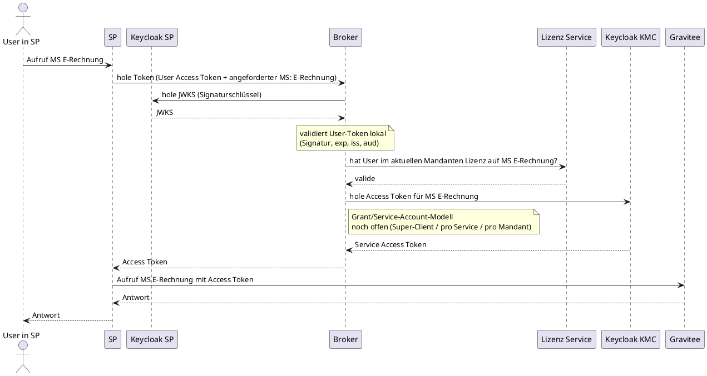
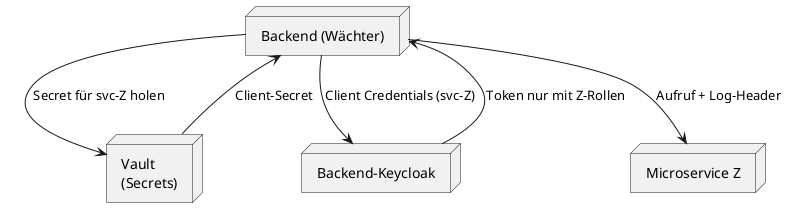
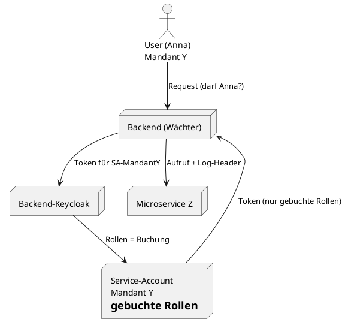
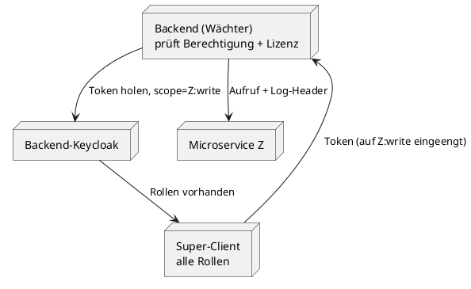
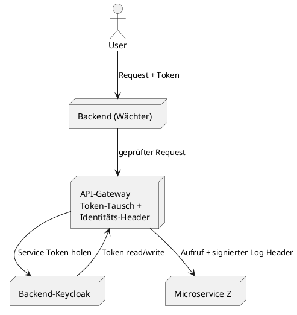

## Kontext

Ausgangslage und wiederkehrende Randbedingungen, die für **alle** Ansätze gelten:

- **Zwei getrennte Keycloak-Instanzen:** ein Frontend-Keycloak (kennt User und deren Mandanten-Zugehörigkeit, Mandantisierung liegt hier) und ein Backend-Keycloak (kennt nur die Microservices als Clients, **keine** Mandantisierung).
- **Vorne steht ein User, kein Service-Account.** Der User existiert nur im Frontend-Keycloak.
- Ein User kann in **mehreren Mandanten** unterschiedliche Client-Roles besitzen. Im Token sollen nur die Rollen des _aktiven_ Mandanten landen.
- Microservices verlangen eigene Rollen (z. B. `read` / `write`). Diese Rollen gehören konzeptionell dem _Mandanten_ bzw. dem _Service-Account_, nicht dem einzelnen User.
- **Skala:** ca. 1000 Mandanten. Buchen/Abbuchen von Services soll **automatisch über das Frontend** ausgelöst werden.
- **Keine** bestehende autoritative Quelle dafür, was ein Mandant gebucht hat – aktuell händisch gepflegt.
- **Identitäts-Weitergabe** an den Microservice ist **nur für Logging/Nachvollziehbarkeit** gedacht, **nicht** autorisierungsrelevant. Der Microservice entscheidet allein anhand der Rollen im Service-Token.

> **Hinweis zu Unsicherheiten:** An mehreren Stellen hängt die Umsetzbarkeit von der konkreten Keycloak-Version ab (Down-Scoping beim Client-Credentials-Flow, Custom-Claims per Protocol-Mapper, Admin-API-Last bei Massen-Updates). Diese Punkte sind jeweils markiert und sollten **vor** einer Architekturentscheidung mit einem kleinen Proof of Concept / Lasttest verifiziert werden.

Dieses Dokument fasst zunächst die **real umsetzbaren** Ansätze zusammen. Nicht-tragfähige, aber diskutierte Varianten (User-Token mit Rollen, Token-Exchange-Chaining) werden in einem späteren Abschnitt als „geprüft & verworfen" ergänzt.

---

## Wiederkehrende Grundstruktur

Fast alle Ansätze teilen dasselbe Grundgerüst und unterscheiden sich nur darin, **wo die Buchungswahrheit liegt** und **wie viele / welche Service-Accounts** es gibt.

Die zwei fachlichen Kernfragen, die der **Wächter** (Backend) immer beantworten muss:

1. **Berechtigung (User-Ebene):** Darf _dieser User_ im Namen des Mandanten handeln?
2. **Lizenz (Mandanten-Ebene):** Hat _der Mandant_ den Service überhaupt gebucht?

Die Ansätze unterscheiden sich vor allem darin, **wo Frage 2 beantwortet wird**.

---

## Ansatz 1 – Dedizierter Lizenz-/Buchungs-Service

### Beschreibung

Die Buchungswahrheit („welcher Mandant hat welche Services gebucht") lebt als **Anwendungsdaten** in einem eigenen **Lizenz-Service** – bewusst _außerhalb_ von Keycloak. Das Frontend schreibt beim Buchen/Abbuchen dorthin. Ein **Broker** fungiert als zentraler Wächter zwischen den beiden Keycloak-Welten: Er validiert das User-Token (Frontend-Keycloak / KSP), fragt beim Lizenz-Service die Buchung ab und holt – nur bei gültiger Lizenz – über den Backend-Keycloak (KKMC) ein Access-Token für den Ziel-Microservice. Der eigentliche Microservice-Aufruf läuft anschließend über das API-Gateway (Gravitee). Keycloak bleibt zuständig für Identität und Token-Ausstellung, nicht für den Buchungszustand.

> **Anmerkung zur Berechtigungsebene:** In diesem Setup gilt bewusst „jeder User des Mandanten darf alles, was der Mandant gebucht hat" – geprüft wird nur die **Lizenz** (Mandanten-Ebene). Ein zusätzlicher **User-Berechtigungs-Check** ist nicht vorgesehen. Falls das später feingranularer werden soll, ist der Broker die richtige Stelle dafür.

### Ablauf (Sequenzdiagramm)

Konkrete Komponenten dieses Setups: **SP** (Frontend/Self-Service-Portal), **KSP** (Keycloak der SP-Seite), **Broker** (Wächter), **Lizenz-Service**, **KKMC** (Keycloak der Microservice-Seite), **Gravitee** (API-Gateway).

> **Offene Punkte in diesem Ablauf:**
> 
> - **Grant-Modell bei `B -> KKMC`:** noch nicht entschieden (Super-Client / Client pro Microservice / Service-Account pro Mandant – siehe Ansätze 2–4). Im Diagramm bewusst als Blackbox.
> - **Identitäts-Weitergabe fürs Logging:** die echte User-Identität sollte als Log-Kontext bis zum Microservice durchgereicht werden (z. B. als Header über Gravitee). Im Diagramm noch nicht ausmodelliert.
> - **Token-Rückgabe an SP:** aktuell erhält SP das Service-Token und ruft Gravitee selbst auf. Ob das Backend-Token zurück ans Frontend gegeben werden soll, ist ein bewusst zu treffender Sicherheits-Trade-off (abhängig davon, ob SP serverseitig oder im Browser läuft).

### Pro / Contra

**Pro**

- Buchungszustand liegt dort, wo er hingehört: hochfrequente, UI-getriebene Anwendungsdaten in einer Datenbank.
- Skaliert sauber auf 1000+ Mandanten; Buchen/Abbuchen ist ein simpler DB-Schreibvorgang.
- Klare Trennung von Lizenz (ändert sich mit Vertrag) und Berechtigung (ändert sich mit Team) – unabhängig pflegbar.
- Keycloak wird nicht zur Datenbank für sich ständig ändernde Zustände zweckentfremdet.
- Volle Nachvollziehbarkeit: der User bleibt durchgehend er selbst.

**Contra**

- Eigene Datenhaltung + Logik (Lizenz-Service) und die Broker-Komponente, die gebaut und gepflegt werden müssen.
- Buchungswahrheit liegt außerhalb von Keycloak – kann als „nicht Keycloak-zentrisch" auf organisatorischen Widerstand stoßen.
- Der Broker braucht weiterhin ein konkretes Grant-Modell, um an das Microservice-Token zu kommen (siehe Ansätze 2–4) – der Lizenz-Service löst nur die _Wahrheitsfrage_, nicht die _Token-Beschaffung_.
- Broker ist ein zentraler Punkt im Pfad – Verfügbarkeit/Redundanz beachten.

---

## Ansatz 2 – Ein Client pro Microservice + Vault

### Beschreibung

Pro Microservice gibt es im Backend-Keycloak **einen eigenen Service-Account-Client**, der genau die Rollen _seines_ Ziel-Microservice trägt. Die Credentials liegen **nicht** im Backend-Code, sondern in einem Secret-Store (Vault, Kubernetes Secrets o. ä.). Das Backend leitet den passenden Account idealerweise per **Namenskonvention** ab (z. B. Client-ID = `svc-<microservice>`), sodass neue Microservices ohne Code-Änderung funktionieren. Die Lizenz-/Berechtigungsprüfung selbst passiert weiterhin im Backend (z. B. via Ansatz 1).

### Diagramm

### Pro / Contra

**Pro**

- Least Privilege pro Microservice: ein geleaktes Secret öffnet nur _einen_ Service, nicht alles.
- Kein Hardcoding von Credentials; Rotation über den Secret-Store.
- Namenskonvention vermeidet eine manuell gepflegte Liste – gut wartbar bei wachsender Service-Zahl.
- Saubere Isolationsgrenzen, auditfreundlich.

**Contra**

- Jeder Service-Account muss trotzdem _angelegt_ werden (auch wenn nicht im Code bekannt).
- Mehr bewegliche Teile: N Accounts, N Secrets, Rotationsprozess.
- Löst nur die Token-Beschaffung – die Buchungswahrheit braucht weiterhin eine eigene Quelle.
- ⚠️ Bei sehr vielen Microservices: Betriebsaufwand für Anlage/Rotation nicht unterschätzen.

---

## Ansatz 3 – Ein Service-Account pro Mandant

### Beschreibung

Statt pro Microservice gibt es pro **Mandant** einen Service-Account im Backend-Keycloak. Dieser trägt genau die Rollen, die _sein Mandant gebucht hat_. Das Backend „loggt sich" für einen Request auf den Mandanten-Account und erhält damit automatisch nur die gebuchten Rollen. Die Lizenzprüfung ist dadurch **in Keycloak eingebacken** („secure by construction") – man kann keine Rolle bekommen, die der Mandant nicht hat. Buchen/Abbuchen bedeutet: Rollen des Mandanten-Accounts per Admin-API ändern.

### Diagramm

### Pro / Contra

**Pro**

- Lizenz ist unfälschbar im Token abgebildet: fehlt die Buchung, fehlt die Rolle – ein vergessener Backend-Check kann keinen Schaden anrichten.
- „Aus Versehen auf falschen Mandanten schalten" ist strukturell ausgeschlossen.
- Buchungszustand und Token-Rollen sind ein und dieselbe Sache – keine zweite Quelle für die Lizenz nötig.

**Contra**

- **~1000 Service-Accounts**, die angelegt, gepflegt und deren Secrets rotiert werden müssen.
- Buchen/Abbuchen = Schreibvorgang auf Keycloak-Rollen via Admin-API → koppelt den Buchungsprozess eng an Keycloak-Administration.
- Buchungszustand (hochfrequent, UI-getrieben) wird in Keycloak-Rollen geführt – konzeptionell die Zweckentfremdung von Keycloak als Zustandsdatenbank.
- User-Berechtigung („darf Anna überhaupt?") muss **trotzdem** separat im Backend geprüft werden – der Mandanten-Account allein würde jedem User des Mandanten alles erlauben.
- ⚠️ Admin-API-Last bei Massen-Updates und Token-Ausstellung für 1000 Accounts unbedingt vorab per Lasttest prüfen.

---

## Ansatz 4 – Super-Client mit allen Rollen (+ Down-Scoping pro Request)

### Beschreibung

Ein **einziger** Backend-Client (ein Secret) trägt alle relevanten Microservice-Rollen. Das Backend holt sich dessen Token und schränkt es pro Request per Scope/Audience auf genau den Ziel-Microservice und die nötige Rolle ein. Die eigentliche Autorisierungsentscheidung (Berechtigung + Lizenz) fällt **vollständig im Backend** – der Super-Client ist ein _kontrollierter Generalschlüssel_, der nie ohne vorherige Prüfung benutzt wird.

### Diagramm

### Pro / Contra

**Pro**

- Technisch am einfachsten: ein Client, ein Secret, keine 1000 Accounts.
- Neue Microservices erfordern nur eine Rollen-Ergänzung am Super-Client.
- Wenig Betriebsaufwand bei der Secret-Verwaltung.

**Contra**

- Der Super-Client „kann alles" – ein geleaktes Secret öffnet **jeden** Microservice. Fettes Angriffsziel.
- Sicherheit hängt vollständig daran, dass das Backend **vor jeder** Nutzung korrekt prüft – ein einziger vergessener Check ist potenziell fatal.
- Widerspricht Least-Privilege; bei Microservice-Teams oft unbeliebt.
- ⚠️ Setzt voraus, dass Keycloak das per-Request-Down-Scoping beim Client-Credentials-Flow sauber unterstützt – **versionsabhängig, vorab per PoC verifizieren.**

---

## Ansatz 5 – API-Gateway als Vermittler

### Beschreibung

Ein API-Gateway sitzt zwischen Backend und Microservices und übernimmt den Übergang zwischen den beiden Welten zentral: Token-Validierung der Frontend-Seite, Beschaffung/Einengung des Backend-Service-Tokens und das signierte Weiterreichen der Identität als Log-Kontext. Statt dass jeder Microservice die Identitäts-Weitergabe selbst behandelt, ist das Gateway die eine vertrauenswürdige Stelle. Kombinierbar mit Ansatz 1/2/4 – das Gateway _ist_ nicht die Wahrheitsquelle, sondern der Durchsetzungspunkt.

### Diagramm

### Pro / Contra

**Pro**

- Zentraler, einheitlicher Ort für Token-Übergang und Identitäts-Weitergabe – nicht in jedem Microservice dupliziert.
- Natürliche Stelle, um den Log-Header nur intern zu akzeptieren (Microservices sind nur hinter dem Gateway erreichbar).
- Entlastet einzelne Microservices; gute Trennung von Fachlogik und Cross-Cutting-Concerns.

**Contra**

- Zusätzliche Infrastruktur-Komponente (Betrieb, Verfügbarkeit, Single Point of Failure, wenn nicht redundant).
- Löst die Wahrheitsfrage (Lizenz/Buchung) **nicht** – braucht weiterhin Ansatz 1 oder 3 dahinter.
- Setzt voraus, dass ein Gateway in der Landschaft existiert oder eingeführt werden darf.

---

## Kurzvergleich

|Ansatz|Wo liegt die Buchungswahrheit?|Anzahl Accounts|Least Privilege|Hauptrisiko|
|---|---|---|---|---|
|1 – Lizenz-Service|Eigene DB (außerhalb KC)|wenige|mittel|Wird als „nicht KC-zentrisch" abgelehnt|
|2 – Client pro Microservice + Vault|(separat, z. B. Ansatz 1)|N (= Services)|hoch|Betriebsaufwand N Accounts/Secrets|
|3 – Account pro Mandant|Keycloak-Rollen|~1000|hoch|Admin-API-Last, KC als Zustands-DB|
|4 – Super-Client|(separat, im Backend)|1|niedrig|Ein Secret öffnet alles|
|5 – API-Gateway|(separat dahinter)|wenige|je nach Kombination|Zusätzliche Infra, löst Wahrheit nicht|

---

## Offene Punkte / vor Entscheidung zu klären

- **Keycloak-Version:** Unterstützt sie per-Request-Down-Scoping (Ansatz 4) und ggf. Custom-Claims per Mapper zuverlässig? → kleiner PoC.
- **Lasttest** für Ansatz 3 (1000 Accounts, Massen-Rollen-Updates, Token-Ausstellungsrate).
- **Organisatorisch:** Ist „muss über Keycloak" eine harte Vorgabe oder eine Team-Meinung? Geht es dabei wirklich um _Autorisierung_ oder nur um _Nachvollziehbarkeit_ (Letztere ist über Logging bereits gelöst)?
- **Abbuchen-Flow:** Der genaue UI-getriggerte Abbuchungsvorgang ist noch nicht spezifiziert – beeinflusst v. a. Ansatz 3 (Rollen entfernen) vs. Ansatz 1 (DB-Update).

---

## Noch zu ergänzen (auf Wunsch)

Als „geprüft & verworfen"-Fälle für die Team-Diskussion:

- **Rollen direkt im gescopten User-Token** – scheitert an der Realm-Grenze (Backend-Keycloak kennt den User nicht).
- **Token-Exchange-Chaining** – setzt einen durchgehend bekannten Prinzipal voraus; bricht an der Grenze zwischen den zwei Keycloaks und an der fehlenden Mandantisierung im Backend-Keycloak.