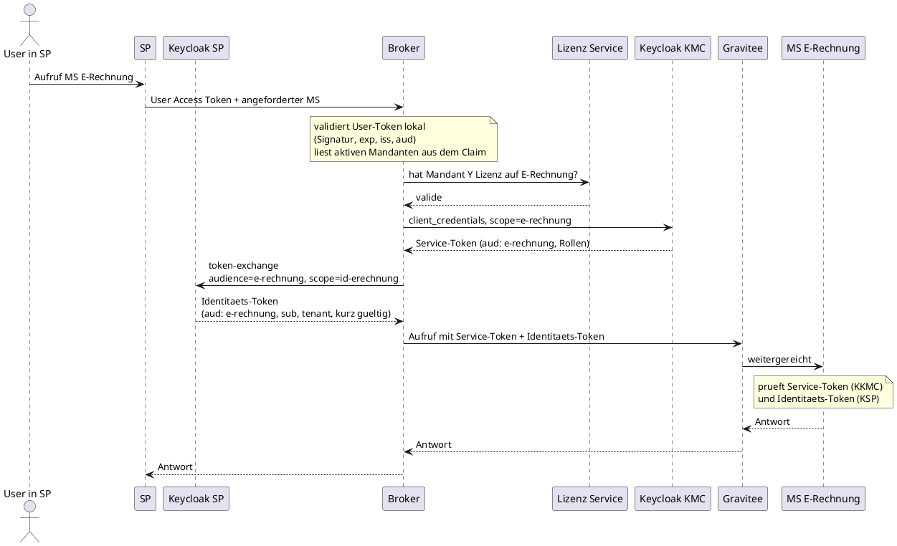

# Ansatz – Zweckgebundenes Identitäts-Token per Token Exchange

> Ausgearbeitet als Ergänzung zu `Loesungsansaetze.md`. Die Nummer vergibst du beim Einsortieren.
> Alle technischen Aussagen sind gegen Keycloak 26.7.2 gemessen; das Protokoll steht am Ende.

## Einordnung

Der Ansatz beantwortet **keine** der beiden bekannten Achsen. Er beantwortet eine dritte, die im
Dokument bisher unter „Identitäts-Weitergabe fürs Logging“ mitläuft:

- **Achse A** – Wo liegt die Buchungswahrheit? (Ansatz 1 / 3)
- **Achse B** – Wie wird das Microservice-Token beschafft? (Ansatz 2 / 4)
- **Achse C** – **Wie kommen Identität und aktiver Mandant zum Microservice?** ← hier

Er ersetzt also weder Ansatz 2 noch 4, sondern ergänzt sie. Kombinierbar mit allem; sinnvoll wird er,
sobald der Microservice den Mandanten kennen muss und nicht nur der Log-Zeile wegen.

## Das Problem, das er löst

Das Service-Token aus dem Backend-Keycloak entsteht über `client_credentials`. Es trägt Rollen und
`aud`, weiß aber vom User nichts — und damit auch nichts vom Mandanten. Hält der Microservice
Mandantendaten, muss der Mandant trotzdem irgendwie ankommen, und zwar in einer Form, der der
Microservice trauen kann. Ein einfacher Header ist das nicht.

Die naheliegende Lösung ist, das User-Token einfach durchzureichen (Roh-Relay). Das funktioniert,
hat aber drei Nachteile: Der Microservice bekommt ein Token, das für das SP ausgestellt wurde und
für jeden anderen Dienst genauso gilt; er bekommt **alle** Claims des Users, auch die Liste sämtlicher
verfügbarer Mandanten, Gruppen und Rollen; und er bekommt es mit der Lebensdauer der SP-Session.

## Beschreibung

Der Broker (oder Gravitee) tauscht das User-Token im **Frontend-Keycloak** gegen ein zweckgebundenes
Identitäts-Token: `aud` = der Ziel-Microservice, Claims reduziert auf das, was dieser braucht —
`sub` und der aktive Mandant —, eigene, kurze Lebensdauer.

Das ist **Standard Token Exchange V2, realm-intern**: derselbe Realm, derselbe Aussteller, kein
Identity Provider, keine Instanzgrenze. Ein offiziell supportetes Feature in 26.7, kein Preview.
Nicht zu verwechseln mit dem Identity Chaining über zwei Instanzen — das ist der Fall am Ende dieses
Dokuments, und der scheidet aus anderen Gründen aus.

Der Microservice bekommt anschließend zwei Tokens: das Service-Token (Autorisierung, ausgestellt vom
Backend-Keycloak) und das Identitäts-Token (Identität und Mandant, ausgestellt vom Frontend-Keycloak,
`aud` auf ihn selbst).

## Ablauf

Der Broker ruft den Microservice hier selbst auf, statt das Service-Token an das SP zurückzugeben.
Das ist unabhängig von diesem Ansatz die richtige Reihenfolge, sobald das SP im Browser läuft.

## Konfiguration

Im **Frontend-Keycloak**, je Ziel-Microservice:

| Objekt | Zweck |
|---|---|
| Client `e-rechnung` | existiert nur als Audience-Ziel. Der Audience-Mapper kann nur einen existierenden Client in `aud` schreiben |
| Client Scope `id-erechnung` | Audience-Mapper auf diesen Client + User-Attribute-Mapper für den Mandanten-Claim. Als **Optional** am Broker-Client |
| Broker-Client | `standard.token.exchange.enabled = true`, **Full scope allowed = Off** (sonst landen alle Rollen des Users im Identitäts-Token) |
| SP-Client | Audience-Mapper, der den **Broker** in die `aud` des User-Tokens schreibt |

Der letzte Punkt ist der, den man nicht rät: Ein Client darf ein fremdes Token nur tauschen, wenn er
**selbst in dessen `aud` steht**. Fehlt das, antwortet Keycloak mit
`access_denied: Client is not within the token audience`. Entweder trägt das SP-Token den Broker als
Audience — oder das SP macht den Exchange selbst, dann entfällt der Mapper.

## Pro / Contra

**Pro**

- **Audience-gebunden.** Das Identitäts-Token gilt nur für einen Microservice. Er kann es nicht bei
  einem anderen wiederverwenden; beim Roh-Relay ginge genau das.
- **Minimiert.** Nur die Claims, die der Microservice braucht. Die Liste aller verfügbaren Mandanten,
  Gruppen und Rollen des Users bleibt draußen.
- **Eigene Lebensdauer.** Sekunden statt SP-Session, unabhängig einstellbar.
- **Signiert.** Damit ist der Mandant autorisierungsfähig und nicht bloß Log-Kontext — die Datentrennung
  im Microservice steht auf einer Signatur statt auf einem Header.
- **`azp` zeigt den Broker.** Im Identitäts-Token ist sichtbar, wer gehandelt hat, während `sub` sagt,
  für wen. Sauberer Audit-Trail, ohne dass der Microservice raten muss.
- Standard-Feature, keine Eigenentwicklung, keine eigene Schlüsselverwaltung.

**Contra**

- **Der Microservice validiert zwei Aussteller.** Service-Token vom Backend-Keycloak, Identitäts-Token
  vom Frontend-Keycloak — zwei JWKS-Quellen, zwei Trust-Konfigurationen. Übernimmt Gravitee die
  Prüfung, sieht der Microservice nur noch geprüfte Werte; dann liegt die Komplexität einmal im
  Gateway statt N-mal im Service.
- **Ein zusätzlicher Token-Call pro Request.** Cachebar pro User + Mandant + Ziel-Microservice bis
  `exp`, aber der Frontend-Keycloak steht damit im synchronen Pfad jedes Backend-Aufrufs.
- **Provisionierung je Microservice** im Frontend-Realm (Audience-Client + Client Scope). Skriptbar,
  aber es ist ein zweiter Ort, an dem neue Services eingetragen werden müssen.
- Lohnt nur, wenn der Microservice Identität oder Mandant wirklich braucht. Ist er mandantenagnostisch
  und das Logging genügt, ist ein Header billiger.

## Alternativen für dieselbe Achse

| Variante | Vorteil | Preis |
|---|---|---|
| **Roh-Relay** des User-Tokens | nichts zu bauen | nicht audience-gebunden, alle Claims, SP-Lebensdauer |
| **Token Exchange** (dieser Ansatz) | zweckgebunden, minimiert, kurz | ein Token-Call, Provisionierung je MS |
| **Gateway-signiertes internes JWT** | unabhängig von Keycloak | eigene Schlüsselverwaltung und Rotation |
| **Service-Account pro Mandant** (Ansatz 3) | ein Token statt zwei | ~1000 Accounts samt Secrets |

---

# Geprüft & verworfen: Identity Chaining über die Instanzgrenze

Ersetzt den Platzhalter in „Noch zu ergänzen“. Die dort notierte Begründung — Token-Exchange-Chaining
breche an der Grenze zwischen den zwei Keycloaks — trifft nicht zu, und das würde in der Diskussion
auffallen: Genau dieser Fall läuft im Testlabor dieses Repos (`SETUP.md`).

**Was es ist.** Der Frontend-Keycloak stellt per Token Exchange eine JWT-Assertion aus, deren `aud`
die Issuer-URL des Backend-Realms ist. Das Backend löst sie per `jwt-bearer` ein und stellt ein
eigenes Token aus. Der Frontend-Keycloak ist für das Backend ein Identity Provider. Beides ist in
26.7 offiziell supported.

**Warum es hier trotzdem ausscheidet** — vier Gründe, alle nachgemessen:

1. **Jeder User braucht einen gespiegelten Backend-User.** Der Grant sucht den Ziel-User
   ausschließlich über eine bestehende Federated Identity und legt ihn **nicht** an
   (`JWTAuthorizationGrantType.java:141-143`, kein First-Broker-Login, keine IdP-Mapper). Gemessen:
   eine gültige Assertion einer nicht verlinkten Identität wird mit
   `invalid_grant: User not found` abgewiesen. Bei ~1000 Mandanten hieße das, das komplette
   User-Verzeichnis vorzuhalten und synchron zu halten.
2. **Der Mandant passt nicht durch.** Die Abbildung hängt am `sub` und ist 1:1 — ein Frontend-`sub`
   kann auf genau einen Backend-User zeigen. Der aktive Mandant wechselt aber pro Request, während
   `sub` konstant bleibt. Und weil im Grant keine IdP-Mapper laufen, landen Claims der Assertion
   (auch ein `tenant`-Claim) **nicht** im ausgestellten Backend-Token. Genau das Problem, das dieser
   Ansatz lösen sollte, löst er also nicht.
3. **Die Rollen kämen aus dem gespiegelten User.** Damit müsste die Buchung als Rollen an diesem User
   gepflegt werden — das ist Ansatz 3, zuzüglich User-Spiegelung.
4. **Es beantwortet die falsche Frage.** Chaining klärt „wer bin ich“ gegenüber dem Backend-Keycloak.
   Laut Kontext ist die Identität aber nicht autorisierungsrelevant; entschieden wird über Rollen im
   Service-Token.

Dazu die Betriebskosten: Jede Assertion gilt genau einmal (`Token reuse detected`), die Session ist
transient, es gibt kein Refresh Token. Pro fachlichem Request also zwei zusätzliche
Keycloak-Roundtrips, von denen sich der erste nicht cachen lässt.

**Wann es die richtige Wahl wäre:** wenn das Backend eigene, benutzerbezogene Autorisierung mit
backend-eigenen Rollen und einer auditierbaren User-Identität bräuchte — also unter der umgekehrten
Prämisse.

---

## Messprotokoll

Keycloak 26.7.2, isolierter Compose-Stack aus diesem Repo, provisioniert mit `setup-realms.sh`,
danach mit `down -v` abgeräumt.

| # | Gemessen | Ergebnis |
|---|---|---|
| 1 | Exchange durch fremden Client | `access_denied: Client is not within the token audience` |
| 2 | Exchange, nachdem der Broker in der `aud` des SP-Tokens steht | `aud: e-rechnung`, `azp: <Broker>`, `sub: <User>`, `tenant: mandant-Y`, keine Rollen |
| 3 | Mandanten-Claim aus User-Attribut, nur bei angefordertem Scope | erscheint mit `scope=id-erechnung`, fehlt ohne |
| 4 | `jwt-bearer` mit gültiger Assertion ohne verlinkten Backend-User | `invalid_grant: User not found` |
| 5 | IdP-Mapper im JWT-Grant | kein Mapper-Aufruf im gesamten Grant-Quellcode |

Ergänzend aus der Down-Scoping-Messung: `client_credentials` mit `scope=<dienst>` liefert `aud` und
`resource_access` genau des angeforderten Dienstes, bis hinunter auf einzelne Rollen, sofern
**Full scope allowed = Off** steht und die Client Scopes Audience-Mapper und Role Scope Mappings
tragen.
