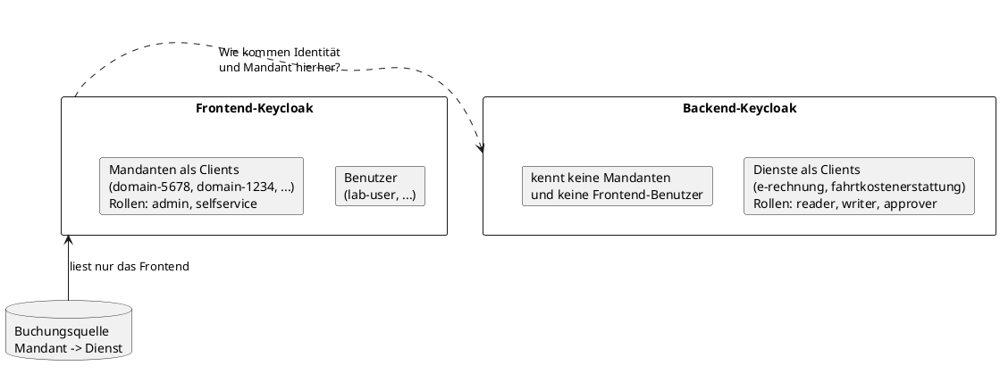
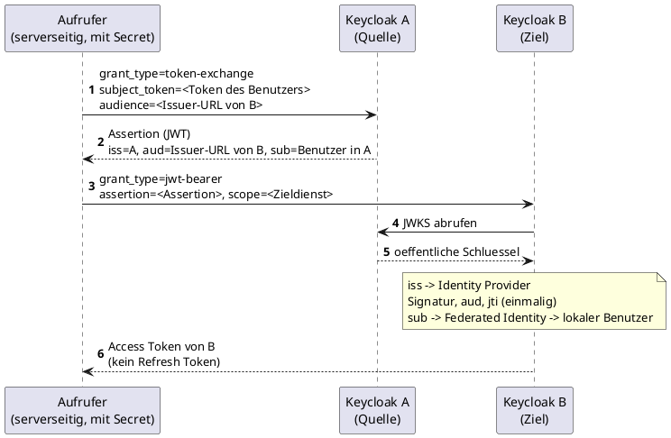
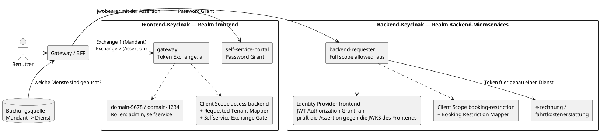
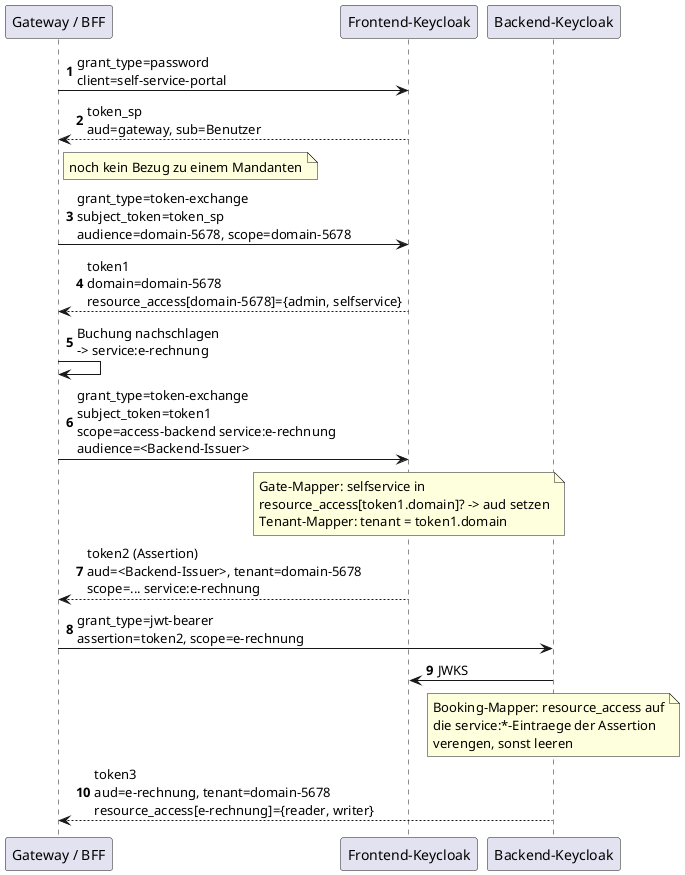
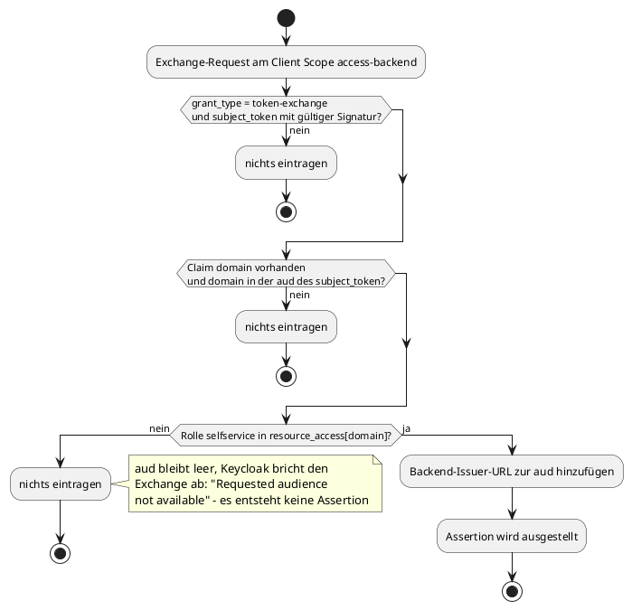

# Benutzer-Token über zwei Keycloak-Instanzen hinweg

Wie ein angemeldeter Benutzer aus dem Frontend-Keycloak ein Access Token des Backend-Keycloak
erhält, das seine Identität, seinen aktiven Mandanten und genau die gebuchten Dienste trägt.
Beschrieben ist der Aufbau, der in einem Labor gegen **Keycloak 26.7.2** gebaut und gemessen wurde;
alle Claims, Aufrufe und Fehlermeldungen in diesem Dokument stammen aus diesen Messungen.

---

## 1. Problem

Zwei Keycloak-Instanzen mit unterschiedlichem Wissen stehen nebeneinander. Der **Frontend-Keycloak**
kennt die Benutzer und die Mandanten: jeder Mandant ist dort ein eigener Client, in der Zielgröße
etwa tausend davon, und ein Benutzer kann in mehreren Mandanten Mitglied sein. Der
**Backend-Keycloak** kennt nur die Microservices als Clients und deren Rollen — von Mandanten weiß
er nichts, von den Benutzern des Frontends ebenfalls nicht.

Vorne steht dabei ein Mensch, kein technischer Account. Er meldet sich im Self-Service-Portal an,
arbeitet in genau einem seiner Mandanten und löst von dort aus Aufrufe an die Backend-Dienste aus.
Im Token ist deshalb immer nur **ein** Mandant aktiv, auch wenn der Benutzer in mehreren Mitglied
ist.

Ein Aufruf ist nur dann erlaubt, wenn zwei unabhängige Fragen mit Ja beantwortet werden. Die erste
ist eine **Berechtigung** auf Benutzerebene: Darf dieser Benutzer aus diesem Mandanten heraus
überhaupt ins Backend? Die zweite ist eine **Buchung** auf Mandantenebene: Hat der aktive Mandant
den angeforderten Dienst überhaupt gebucht? Nicht gefordert ist eine feingranulare Rechtevergabe je
Benutzer innerhalb eines Mandanten — wer im Mandanten drin ist, darf dort dasselbe.

Der naheliegende Weg scheitert an der Technik. Das Frontend-Token einfach an den Token-Endpoint des
Backends zu schicken geht nicht: Standard Token Exchange V2 arbeitet ausschließlich realm-intern
und weist ein Token mit fremdem Issuer ab. Das Frontend-Token unverändert an die Dienste
weiterzureichen wäre die andere Variante, ist aber keine: Es ist nicht an das Backend gebunden,
trägt sämtliche Claims des Frontends mit und lebt so lange wie die Portal-Sitzung.

Ein früherer Entwurf hielt den Weg über die Instanzgrenze deshalb für grundsätzlich nicht
umsetzbar — das Backend kenne weder den Benutzer noch die Mandanten, es gebe dort keinen
Prinzipal, gegen den getauscht werden könnte. Das hat sich als falsch herausgestellt.



---

## 2. Ziel

Angestrebt ist ein Access Token des Backend-Keycloak mit vier Eigenschaften.

Es trägt die **Identität** des Frontend-Benutzers, ist also auditierbar und nicht hinter einem
technischen Sammelaccount anonymisiert. Es transportiert den **aktiven Mandanten** so, dass der
Aufrufer ihn nicht frei wählen kann — der Mandant muss aus dem vorgelegten Token abgeleitet werden,
nicht aus einem Request-Parameter. Es ist auf **genau einen Dienst** zugeschnitten und enthält nur
die Rollen, die der Benutzer dort hat, verengt auf das, was der Mandant gebucht hat. Und es entsteht,
ohne dass **Rollen über die Realm-Grenze wandern**: Was jemand im Backend darf, entscheidet allein
das Backend.

Dazu kommt eine Abgrenzung, die den ganzen Zuschnitt prägt: Die Buchungsdaten bleiben **außerhalb**
von Keycloak. Buchungsstände sind Geschäftsdaten und ändern sich laufend; sie in einen
Token-Aussteller zu kopieren, brächte ein Synchronisationsproblem zurück, das gerade beseitigt
werden soll.

---

## 3. Der Tausch zwischen zwei Keycloak-Instanzen

**Token Exchange V2** tauscht ein Token gegen ein anderes, anders zugeschnittenes Token —
allerdings nur innerhalb desselben Realms. Der Aufrufer legt ein Token vor (`subject_token`), nennt
den gewünschten Empfänger (`audience=`) und die gewünschten Scopes, und bekommt ein neues Token
zurück, das denselben Benutzer ausweist, aber für einen anderen Zweck gilt. Ein Token mit fremdem
Issuer wird dabei abgewiesen.

Für den Weg über die Instanzgrenze kombiniert Keycloak deshalb zwei Bausteine, was in der
Keycloak-Dokumentation **Identity Chaining** heißt. Der Kniff steckt im ersten Schritt: Der Token
Exchange erzeugt kein gewöhnliches Bearer-Token, sondern ein JWT, dessen `aud` die **Issuer-URL des
Ziel-Realms** ist. Ein solches Token ist für keinen Dienst als Zugriffstoken brauchbar — es ist eine
**Assertion**, ein Nachweis. Im zweiten Schritt reicht der Aufrufer diese Assertion beim Ziel-Realm
ein (`grant_type=urn:ietf:params:oauth:grant-type:jwt-bearer`, der JWT Authorization Grant nach
RFC 7523), und der Ziel-Realm stellt daraufhin sein eigenes Token aus. Die Quelle ist für das Ziel
also schlicht ein **Identity Provider**.

Beim Einlösen prüft der Ziel-Realm fünf Dinge:

1. **`iss`** — findet den passenden Identity Provider. Passt der Issuer nicht exakt, scheitert der
   Aufruf mit `No Identity Provider for provided issuer`.
2. **Signatur** — über die JWKS-URL dieses Identity Providers, also mit dem öffentlichen Schlüssel
   des ausstellenden Realms.
3. **`aud`** — muss die eigene Realm-Issuer-URL sein, sonst `Invalid token audience`.
4. **`jti`** — darf noch nicht verwendet worden sein. Jede Assertion gilt genau **einmal**.
5. **`sub`** — muss über eine **Federated Identity** auf einen lokalen Benutzer zeigen. Der Grant
   legt niemanden an; fehlt die Verknüpfung, antwortet Keycloak mit `User not found`.

Daraus folgen drei Eigenschaften, die man kennen muss. Die Assertion ist ein Einmal-Ticket mit
kurzer Lebensdauer, ein abgefangenes Exemplar nützt ohne das Client-Secret des Einlösers nichts.
Das ausgestellte Token hat **kein Refresh Token**, der Grant erzeugt eine transiente Sitzung — läuft
es ab, muss die Kette neu laufen. Und die Vertrauensbeziehung ist **realm-weit**, nicht client-genau:
Der Ziel-Realm prüft, ob die Assertion an ihn adressiert ist, nicht, welcher seiner Clients sie
einlöst.

> **Begriffsfalle.** Was umgangssprachlich „Token Exchange zwischen zwei Keycloaks" heißt, ist
> technisch Token Exchange **plus** JWT Authorization Grant. Der alte einzelne Request mit
> `subject_issuer` (Legacy Token Exchange V1) konnte das in einem Aufruf, ist aber deprecated. Beide
> hier verwendeten Bausteine sind ab Keycloak 26.7 offiziell unterstützt, kein Preview-Feature.

Als Muster, mit Platzhaltern:

```bash
# Schritt 1 im Quell-Realm: Assertion fuer den Ziel-Realm erzeugen
curl -s -X POST "$QUELLE/realms/$QUELL_REALM/protocol/openid-connect/token" \
  -d grant_type=urn:ietf:params:oauth:grant-type:token-exchange \
  -d subject_token_type=urn:ietf:params:oauth:token-type:access_token \
  -d subject_token="$USER_TOKEN" \
  -d audience="$ZIEL/realms/$ZIEL_REALM" \
  -d client_id="$REQUESTER" -d client_secret="$REQUESTER_SECRET"

# Schritt 2 im Ziel-Realm: Assertion einloesen
curl -s -X POST "$ZIEL/realms/$ZIEL_REALM/protocol/openid-connect/token" \
  -d grant_type=urn:ietf:params:oauth:grant-type:jwt-bearer \
  -d assertion="$ASSERTION" \
  -d scope="$ZIELDIENST" \
  -d client_id="$ZIEL_REQUESTER" -d client_secret="$ZIEL_SECRET"
```



---

## 4. Lösung

### 4.1 Überblick

Die Kette besteht aus vier Tokens und drei Tauschvorgängen. Ein **Gateway** — serverseitig, mit
eigenem Client-Secret — ist dabei der Requester **beider** Exchange-Schritte: Es tauscht das
Portal-Token zuerst realm-intern auf den aktiven Mandanten und dann dasselbe Ergebnis erneut gegen
die Assertion für das Backend. Der Benutzer bleibt über die ganze Kette derselbe; verändert wird nur,
wofür das jeweilige Token gilt.

| Token | Wo | Grant | Was neu hinzukommt |
|---|---|---|---|
| `token_sp` | Frontend | `password` | Identität des Benutzers, `aud: gateway` |
| `token1` | Frontend | `token-exchange` | aktiver Mandant: Claim `domain` und `resource_access[domain]` |
| `token2` | Frontend | `token-exchange` | **Assertion**: `aud` = Backend-Issuer, `tenant`, gebuchte `service:*`-Scopes |
| `token3` | Backend | `jwt-bearer` | Backend-Identität, `aud` = Zieldienst, Rollen des Backend-Benutzers, verengt auf das Gebuchte |

Drei **Custom Protocol Mapper** schärfen die Kette an den Stellen, an denen Bordmittel nicht
ausreichen: zwei im Frontend beim Bau der Assertion, einer im Backend beim Bau des Ergebnistokens.





### 4.2 Frontend-Keycloak

Im Frontend-Realm stehen fünf Arten von Objekten, die zusammenwirken.

| Objekt | Rolle in der Kette |
|---|---|
| Client `self-service-portal` | Anmeldung des Benutzers. Trägt den Client Scope `to-gateway` als Default, dessen Audience-Mapper `aud: gateway` setzt — ohne das dürfte das Gateway das Token nicht tauschen |
| Client `gateway` | Requester **beider** Exchange-Schritte, der einzige Client mit `standard.token.exchange.enabled`. Alle anderen Grants sind aus, `Full scope allowed` ist **aus** |
| Clients `domain-5678`, `domain-1234` | Die Mandanten. Reine Ziel- und Rollenträger mit den Client-Rollen `admin` und `selfservice`, ohne eigene Flows und ohne Service Account |
| Client mit der Backend-Issuer-URL als ID | Existiert nur, damit die Backend-Issuer-URL überhaupt in eine `aud` geschrieben werden kann — Keycloak nimmt dort nur IDs existierender Clients auf. Keine eigene Rolle |
| Client Scopes | `domain-*` tragen die Role Scope Mappings des jeweiligen Mandanten und einen Hardcoded-Claim `domain=<Name>`; `access-backend` trägt die beiden Custom Mapper; `service:*` sind reine Marker ohne jede Rollenzuweisung |

Zwei Mechanismen entscheiden hier mehr, als ihr unscheinbares Aussehen vermuten lässt.

**Die `aud` von `token1` entsteht über Rollen, nicht über einen Mapper.** Der eingebaute
`AudienceResolveProtocolMapper` schreibt jeden Client in die `aud`, in dem der Benutzer aufgelöste
Rollen hat. Der Parameter `audience=` **filtert** diese Menge anschließend nur — er fügt nichts
hinzu. Deshalb sind `scope=` und `audience=` beide nötig: `scope=` aktiviert die Role Scope Mappings
des Mandanten und erzeugt damit die Rollen, `audience=` schneidet das Ergebnis auf diesen einen
Mandanten zu. Der Preis dieser Konstruktion: Wer auf dem Ziel-Mandanten keine einzige Rolle hat,
bekommt kein Token mit leeren Rechten, sondern `400 invalid_request — Requested audience not
available`. Fehlende Berechtigung sieht damit aus wie ein Konfigurationsfehler.

**Die Rollenverteilung ist absichtlich asymmetrisch.** Der Beispielbenutzer `lab-user` trägt auf
`domain-5678` die Rollen `admin` und `selfservice`, auf `domain-1234` nur `admin`. Der interne
Exchange gelingt aus beiden Mandanten — `admin` genügt dafür. Nur der externe Schritt zum Backend
unterscheidet die beiden Fälle, und zwar ausschließlich anhand des Inhalts von `token1`.

`Full scope allowed` steht am `gateway` aus einem eigenen Grund auf **aus**: Solange `audience=`
mitgeschickt wird, filtert Keycloak ohnehin. Der Schalter greift genau dann, wenn `audience=`
weggelassen wird — mit `an` trüge das Token dann jede Client-Rolle des Benutzers.

### 4.3 Backend-Keycloak

Der Backend-Realm vertraut dem Frontend über einen **Identity Provider**. Er ist ohne Discovery
konfiguriert, weil zwei Felder bewusst verschiedene Hosts nennen müssen: Der `issuer` ist die URL,
unter der die Tokens ausgestellt werden und die exakt so im `iss` steht; die `jwksUrl` ist die
Adresse, unter der das Backend den Frontend-Realm tatsächlich erreicht — im Container-Betrieb also
der Servicename, nicht `localhost`. Genau hier entstehen die meisten Fehlschläge: Stimmt der
`issuer` nicht exakt, kommt `No Identity Provider for provided issuer`; zeigt die `jwksUrl` auf den
falschen Host, läuft der Aufruf in einen Timeout. Am Identity Provider ist außerdem der JWT
Authorization Grant aktiviert, die Wiederverwendung von Assertions abgeschaltet und deren maximale
Gültigkeit auf 600 Sekunden begrenzt.

Eingelöst wird die Assertion vom Client `backend-requester`. Er hat den JWT Authorization Grant an,
führt den Identity Provider `frontend` in seiner Allow-Liste und hat `Full scope allowed` **aus** —
dieser eine Schalter trägt die gesamte Trennung zwischen den Diensten. Steht er auf `an`, landen
alle Rollen des Benutzers im Token, unabhängig vom angeforderten Scope. Die Dienst-Scopes
`e-rechnung` und `fahrtkostenerstattung` sind ihm als **optional** zugewiesen, der Scope mit dem
Booking-Mapper als **Default**, damit dieser bei jedem Aufruf greift.

Die Ziel-Dienste selbst sind reine Resource Server: Clients mit Rollen, ohne Flows, ohne Service
Account. Ihr gleichnamiger Client Scope trägt jeweils den Audience-Mapper und die Role Scope
Mappings — er entscheidet, welche Rollen bei aktivem Scope überhaupt ins Token dürfen.

Der Ziel-Benutzer im Backend ist über eine **Federated Identity** an den `sub` des Frontend-Benutzers
gebunden und trägt die Dienst-Rollen direkt. Damit beantworten vier verschiedene Stellen vier
verschiedene Fragen:

| Frage | Beantwortet durch |
|---|---|
| Wer bin ich? | der über die Federated Identity gefundene Backend-Benutzer (`sub`) |
| Wer fragt? | der einlösende Client, ausgewiesen mit eigenem Secret (`azp`) |
| Wofür gilt es? | `scope=` wählt den Zieldienst, der Audience-Mapper setzt `aud` |
| Was darf ich? | die Rollen des Backend-Benutzers, gefiltert über die Role Scope Mappings |

Die Abbildung vom Frontend- auf den Backend-Benutzer ist dabei **eindeutig und nicht beeinflussbar**:
Keycloak sucht ausschließlich über den `sub` der Assertion. Weder ein Request-Parameter noch der
einlösende Client noch der Scope können den Ziel-Benutzer verändern. Ein kompromittiertes
Frontend-Secret gibt einem Angreifer die Rechte genau dieser einen Backend-Identität — und keinen
Hebel, sich eine andere auszusuchen.

### 4.4 Gateway/BFF als Enforcement Point der Buchung

Die Buchungsquelle — eine Zuordnung von Mandant zu Dienst, im Labor eine CSV-Datei, produktiv eine
Datenbank — liegt bewusst außerhalb von Keycloak. Gelesen wird sie allein vom Gateway: Es schlägt
für den aktiven Mandanten nach, welche Dienste gebucht sind, und fordert beim externen Exchange
genau die passenden `service:*`-Scopes an. Keycloak prüft daraufhin nur, dass diese Scopes dem
Gateway überhaupt zugewiesen sind — **nicht**, ob der Mandant den Dienst tatsächlich gebucht hat.

Das ist eine Entscheidung, keine Lücke: Buchungsstände sind Geschäftsdaten, und jede Kopie davon in
Keycloak (als Gruppen, Rollen oder Client-Attribute) brächte das Synchronisationsproblem zurück.
Auch eine Laufzeitabfrage der Datenbank aus einem Mapper heraus wäre keine gute Idee — der
Token-Endpoint hinge dann an deren Verfügbarkeit und Latenz, und das bei mehreren Exchanges pro
Kette.

Die Konsequenz muss aber klar benannt sein: **Das Gateway ist der Policy Enforcement Point der
Buchung.** Keycloak setzt sie nicht durch, es signiert die Entscheidung des Gateways und sorgt
dafür, dass das Backend nicht mehr freigibt als behauptet. Daraus folgen Betriebsanforderungen: Das
Gateway läuft rein serverseitig, sein Secret ist geschützt, die Scope-Auswahl stammt ausschließlich
aus der Buchungsquelle und niemals aus Benutzereingaben, und jede Buchungsentscheidung wird mit
Mandant, Benutzer und Dienst protokolliert.

### 4.5 Die drei Custom Protocol Mapper

Warum überhaupt eigener Code? Weil zwei Fragen mit Bordmitteln nicht ausdrückbar sind. Die erste:
„Darf dieser Benutzer **aus diesem Mandanten heraus** zum Backend?" Ein natives Role Scope Mapping
sieht nur die statischen Rollenzuweisungen eines Benutzers, nicht, für welchen Mandanten das gerade
vorgelegte Token ausgestellt wurde — der aktive Mandant steckt ausschließlich im **Inhalt** des
`subject_token`. Die zweite: „Gilt im Backend nur, was die Assertion gebucht hat?" Der
JWT-Authorization-Grant bildet **keine** Schnittmenge aus dem `scope` der Assertion und dem `scope`
des Requests; ohne eigenen Mapper wäre die Buchung schlicht wirkungslos.

Alle drei Mapper lesen den jeweiligen Token-Parameter direkt aus dem laufenden Request, prüfen
selbst den `grant_type` und verhalten sich in jedem Zweifelsfall **fail-closed**: Im Fehlerfall wird
nichts gesetzt, statt etwas zu raten.

#### Requested Tenant Mapper (Frontend)

**Zweck.** Er schreibt den mandantenbindenden Claim `tenant` in die Assertion.

**Liest.** Den `subject_token` (also `token1`) aus den Formularparametern des Exchange-Requests,
daraus den Claim `domain` und die `aud`.

**Schreibt.** `tenant = token1.domain`.

**Fehlerfall.** Fehlt der Claim, passt der Grant nicht oder scheitert eine der Prüfungen, setzt er
den Claim nicht — der Exchange selbst läuft weiter, die Assertion bleibt aber ohne Mandantenbezug.

**Härtung.** Er akzeptiert nur `grant_type=urn:ietf:params:oauth:grant-type:token-exchange`,
verifiziert die Signatur von `token1` selbst und verlangt, dass `domain` auch in dessen `aud` steht.
Ein früherer Stand übernahm stattdessen einen frei wählbaren Request-Parameter `requested_tenant` —
das war eine Rechteausweitung und ist geschlossen. Wer den Parameter heute mitschickt, bewirkt
nichts.

#### Selfservice Exchange Gate (Frontend)

**Zweck.** Er entscheidet, ob der externe Exchange überhaupt gelingt.

**Liest.** Den `subject_token`, daraus `domain`, `aud` und `resource_access[domain]`.

**Schreibt.** Genau einen Eintrag in `aud` — die Backend-Issuer-URL —, und zwar nur, wenn der
Benutzer im **aktiven** Mandanten die konfigurierte Rolle (`selfservice`) trägt.

**Fehlerfall.** Er trägt nichts ein.

**Wie das blockiert.** Der Mapper wirft keine Ausnahme. Keycloak lässt beim Bau des Tokens zuerst
alle Protocol Mapper laufen und entfernt **danach** aus der angeforderten Audience alles, was nicht
im Token steht. Wurde nichts eingetragen, lässt sich die angeforderte Audience nicht auflösen, und
der gesamte Exchange bricht ab: `invalid_request — Requested audience not available`. Es entsteht
kein `token2`, der Backend-Schritt ist damit unerreichbar.

**Härtung.** Wie beim Tenant-Mapper: nur beim Token-Exchange-Grant aktiv, eigene Signaturprüfung des
`subject_token`, `domain` muss in dessen `aud` stehen.



#### Booking Restriction Mapper (Backend)

**Zweck.** Er verengt das Ergebnistoken auf die Dienste, die laut Assertion gebucht sind.

**Liest.** Die `assertion` aus den Formularparametern des jwt-bearer-Requests, daraus den
`scope`-Claim und den Claim `tenant`.

**Schreibt.** Er entfernt aus `resource_access` jeden Eintrag, dessen Client nicht als
`service:<Name>` im `scope` der Assertion vorkommt. Bleibt danach mindestens ein Dienst übrig,
kopiert er zusätzlich `tenant` in das Ergebnistoken.

**Fehlerfall.** `resource_access` bleibt leer — und dann bewusst auch ohne `tenant`, weil „keine
Rollen, aber ein Mandant" ein widersprüchliches Token wäre. Der Aufruf selbst gelingt; ablehnen muss
dann der Dienst.

**Härtung.** Er akzeptiert nur `grant_type=urn:ietf:params:oauth:grant-type:jwt-bearer`. Eine
eigene Signaturprüfung führt er bewusst **nicht** durch: Die Assertion stammt vom fremden Realm,
dessen Schlüssel hier nicht lokal vorliegt — geprüft hat sie der Grant bereits über die JWKS-URL des
Identity Providers, bevor der Token-Bau beginnt. Der Mapper läuft mit erhöhter Priorität, damit
`resource_access` zum Zeitpunkt der Verengung bereits gefüllt ist.

#### Die drei im Vergleich

| | Requested Tenant | Selfservice Gate | Booking Restriction |
|---|---|---|---|
| Instanz | Frontend | Frontend | Backend |
| Client Scope | `access-backend` (optional) | `access-backend` (optional) | `booking-restriction` (Default) |
| Liest | `subject_token` | `subject_token` | `assertion` |
| Schreibt | Claim `tenant` | Eintrag in `aud` | verengt `resource_access`, kopiert `tenant` |
| Geprüfter Grant | token-exchange | token-exchange | jwt-bearer |
| Eigene Signaturprüfung | ja | ja | nein (Grant prüft über JWKS) |
| Blockiert den Aufruf | nein | **ja**, indirekt | nein (Token bleibt leer) |

Die Asymmetrie bei der Signaturprüfung hat einen einfachen Grund: Im Frontend stammt das gelesene
Token aus demselben Realm, der Schlüssel liegt also lokal vor. Im Backend ist der Aussteller ein
fremder Realm — dort prüft der Grant, nicht der Mapper.

### 4.6 Die vier Tokens

Gemessen, gekürzt auf das Wesentliche:

```jsonc
// token_sp - Password Grant, noch ohne jeden Bezug zur Ziel-Domain
{ "iss": "http://localhost:8080/realms/frontend", "azp": "self-service-portal",
  "sub": "8eb1bec2-…", "aud": "gateway", "scope": "to-gateway profile email" }

// token1 - interner Exchange, zugeschnitten auf domain-5678
{ "iss": "http://localhost:8080/realms/frontend", "azp": "gateway",
  "sub": "8eb1bec2-…", "aud": "domain-5678", "domain": "domain-5678",
  "scope": "domain-5678 profile email",
  "resource_access": { "domain-5678": { "roles": ["admin", "selfservice"] } } }

// token2 - die Assertion. Die aud entsteht nur, weil token1 im aktiven Mandanten
// die Rolle selfservice traegt.
{ "iss": "http://localhost:8080/realms/frontend", "azp": "gateway",
  "sub": "8eb1bec2-…", "aud": "http://localhost:8181/realms/Backend-Microservices",
  "scope": "profile email access-backend service:e-rechnung", "tenant": "domain-5678",
  "jti": "ntrtte:1e1451ae-…" }

// token3 - finales Access Token des Backends
{ "iss": "http://localhost:8181/realms/Backend-Microservices", "azp": "backend-requester",
  "sub": "80d521cb-…", "aud": "e-rechnung",
  "scope": "profile booking-restriction email e-rechnung",
  "resource_access": { "e-rechnung": { "roles": ["reader", "writer"] } },
  "tenant": "domain-5678" }
```

Der `sub` wechselt zwischen `token2` und `token3`: dieselbe Person, zwei Realms, zwei IDs — die
Federated Identity ist das Wörterbuch dazwischen.

**`tenant` ist kein Audit-Claim.** Das Backend kennt keine Mandanten mehr, und der Backend-Benutzer
trägt für alle Mandanten dieselben Rollen. Außer `tenant` gibt es im Ergebnistoken nichts, woran ein
Dienst seine Daten trennen könnte. Wer mandantengetrennte Daten hält, **muss** deshalb nach `tenant`
filtern und Tokens ohne diesen Claim ablehnen. Die Integrität des Claims hängt am Tenant-Mapper, der
ihn aus dem aktiven Mandanten ableitet, und am Gate, das den Exchange nur mit gültigem Mandanten und
passender Rolle zulässt.

### 4.7 Die konkreten Aufrufe

```bash
FE=http://localhost:8080
BE=http://localhost:8181
SP_SECRET=lab-frontend-sp-secret
GW_SECRET=lab-frontend-gateway-secret
BS=lab-backend-requester-secret
BI=http://localhost:8181/realms/Backend-Microservices

# 1 - Password Grant des Benutzers am Self-Service-Portal
token_sp=$(curl -s -X POST "$FE/realms/frontend/protocol/openid-connect/token" \
  -d grant_type=password \
  -d username=lab-user -d password=lab-user \
  -d client_id=self-service-portal -d client_secret="$SP_SECRET" | jq -r .access_token)

# 2 - interner Exchange via gateway auf den aktiven Mandanten
token1=$(curl -s -X POST "$FE/realms/frontend/protocol/openid-connect/token" \
  -d grant_type=urn:ietf:params:oauth:grant-type:token-exchange \
  -d subject_token_type=urn:ietf:params:oauth:token-type:access_token \
  -d subject_token="$token_sp" \
  -d audience=domain-5678 -d scope=domain-5678 \
  -d client_id=gateway -d client_secret="$GW_SECRET" | jq -r .access_token)

# 3 - externer Exchange via gateway: die Assertion fuer das Backend. Der Mandant kommt
# aus token1 selbst, kein Parameter noetig. scope traegt zusaetzlich die Buchung: das
# Gateway hat sie in der Buchungsquelle nachgeschlagen.
token2=$(curl -s -X POST "$FE/realms/frontend/protocol/openid-connect/token" \
  -d grant_type=urn:ietf:params:oauth:grant-type:token-exchange \
  -d subject_token_type=urn:ietf:params:oauth:token-type:access_token \
  -d subject_token="$token1" \
  -d scope="access-backend service:e-rechnung" \
  -d audience="$BI" \
  -d client_id=gateway -d client_secret="$GW_SECRET" | jq -r .access_token)

# 4 - Assertion im Backend einloesen, zugeschnitten auf genau einen Dienst
token3=$(curl -s -X POST "$BE/realms/Backend-Microservices/protocol/openid-connect/token" \
  -d grant_type=urn:ietf:params:oauth:grant-type:jwt-bearer \
  -d assertion="$token2" \
  -d scope=e-rechnung \
  -d client_id=backend-requester -d client_secret="$BS" | jq -r .access_token)
```

Mit `scope=fahrtkostenerstattung` im letzten Schritt — und der passenden Buchung im dritten —
liefert derselbe Ablauf ein Token für den anderen Dienst. Das ist der Kern: ein Mechanismus, zwei
Zuschnitte.

### 4.8 Gegenproben

**Ohne die Rolle im aktiven Mandanten bleibt das Backend zu.** Wird `token1` für `domain-1234`
ausgestellt, wo der Benutzer nur `admin` trägt, gelingt der interne Exchange weiterhin — der externe
nicht:

```bash
curl -s -X POST "$FE/realms/frontend/protocol/openid-connect/token" \
  -d grant_type=urn:ietf:params:oauth:grant-type:token-exchange \
  -d subject_token_type=urn:ietf:params:oauth:token-type:access_token \
  -d subject_token="$token1_1234" \
  -d scope="access-backend service:e-rechnung" -d audience="$BI" \
  -d client_id=gateway -d client_secret="$GW_SECRET" | jq
```

```json
{ "error": "invalid_request",
  "error_description": "Requested audience not available: http://localhost:8181/realms/Backend-Microservices" }
```

**Ein nicht gebuchter Dienst bleibt leer.** Die Assertion oben bucht nur `service:e-rechnung`. Wird
im Backend trotzdem der andere Dienst angefordert, entsteht zwar ein Token mit korrekter `aud` —
aber ohne Rollen und ohne `tenant`:

```bash
curl -s -X POST "$BE/realms/Backend-Microservices/protocol/openid-connect/token" \
  -d grant_type=urn:ietf:params:oauth:grant-type:jwt-bearer -d assertion="$token2" \
  -d scope=fahrtkostenerstattung \
  -d client_id=backend-requester -d client_secret="$BS"
#  -> "aud": "fahrtkostenerstattung", "resource_access": {}, kein tenant-Claim
```

Das ist der eigentliche Beweis, dass der Mapper durchsetzt statt zu vertrauen: Der Backend-Benutzer
**hat** Rollen für diesen Dienst und der Scope ist dem Requester zugewiesen — ohne den Mapper käme
hier ein ganz normales Token zurück.

**Jede Assertion gilt einmal.** Dieselbe Assertion ein zweites Mal einzulösen ergibt
`invalid_grant — Token reuse detected`. Und `token1` direkt als Assertion einzureichen scheitert mit
`invalid_grant — Invalid token audience`; es ist an den Mandanten adressiert, nicht an das Backend.

Diese und weitere Fälle — darunter ein gefälschter, unsignierter `subject_token` und der wirkungslos
gewordene `requested_tenant`-Parameter — laufen als automatisierter Verhaltenstest der Kette mit
zwölf Fällen und werden bei jedem Keycloak-Upgrade ausgeführt.

---

## 5. Probleme, Trade-offs und offene Punkte

### 5.1 Betriebliche Kosten

| Kostenpunkt | Auswirkung | Einordnung |
|---|---|---|
| Drei eigene Mapper, die auf nicht dokumentierten Interna aufsetzen (Formularparameter im Mapper lesen, Token-Transformation überschreiben, Mapper-Reihenfolge) | Jedes Keycloak-Upgrade kann den Ansatz still brechen — in Richtung „Exchange schlägt fehl", nicht in Richtung „zu viel Zugriff" | Tragbar, solange ein automatisierter Regressionstest bei jedem Versionssprung läuft |
| Ein Backend-Benutzer je Frontend-Benutzer, die Federated Identity muss vorher existieren | Der Grant provisioniert nicht. Ohne Synchronisation oder Erst-Login-Flow scheitert jeder neue Benutzer mit `User not found` | **Der größte Betriebsaufwand. Muss vor einem Rollout gelöst sein** |
| Rollen im Backend gelten pro Benutzer, nicht pro Mandant | „reader in Mandant A, writer in Mandant B" ist nicht abbildbar | Fachliche Annahme. Trifft sie nicht zu, braucht es einen Rollenschnitt in der Kette |
| Vier Token-Requests je Kette, kein Refresh Token, Assertion einmalig, je Ergebnistoken eine transiente Sitzung | Das Gateway muss Tokens je Kombination aus Benutzer, Mandant und Dienst zwischenspeichern und die Kette bei Ablauf ab dem Assertion-Schritt neu laufen lassen | Handhabbar, gehört aber in die Kapazitätsplanung |
| Password Grant als Einstieg | In OAuth 2.1 gestrichen | Für ein Labor in Ordnung; produktiv Authorization Code mit PKCE. Am Rest der Kette ändert das nichts |

### 5.2 Vertrauensgrenzen

**Die Buchung setzt das Gateway durch, nicht Keycloak.** Ein Fehler oder eine Kompromittierung im
Gateway gibt jedem Mandanten, dessen Benutzer die Rolle `selfservice` haben, jeden Dienst — Keycloak
fängt das nicht auf. Der Mapper im Backend erzwingt „nicht mehr, als das Gateway behauptet hat",
nicht „die Buchung". Sein Wert bleibt trotzdem real: Die Entscheidung liegt signiert in der
Assertion, die Dienste brauchen keinen Zugriff auf die Buchungsdaten, und das Ergebnistoken
dokumentiert nachvollziehbar, was behauptet wurde.

**Die Vertrauensbeziehung ist realm-weit.** Jeder Backend-Client mit JWT Authorization Grant und dem
Frontend in seiner Allow-Liste kann jede gültige Assertion einlösen und wählt den `scope=` selbst;
der ausstellende Client der Assertion wird dabei nicht geprüft. Mit einem einzigen Requester ist das
unkritisch, mit mehreren wird der Kreis der Einlöser zur Konfigurationsfrage. Abhilfe wäre eine
Client Policy, die den ausstellenden Client erzwingt, oder eine eigene Audience-Client-ID je
Requester.

### 5.3 Angreifermodell

Alle beteiligten Endpunkte verlangen Client-Authentifizierung. Ohne ein Secret gibt es keinen
Einstieg.

| Verloren | Was der Angreifer erreicht | Was ihn stoppt |
|---|---|---|
| Benutzer-Passwort | nichts | das Portal ist ein confidential Client |
| Portal-Secret + Passwort | ein Portal-Token | kein Exchange ohne Gateway-Secret; ein Portal-Token hat keinen Mandanten-Claim und scheitert am Gate |
| Gateway-Secret allein | nichts, es fehlt ein gültiges Benutzer-Token | der Exchange braucht ein signiertes Token als Subjekt |
| Gateway-Secret **und** ein gültiges Benutzer-Token | eine Assertion für jeden Mandanten, in dem der Benutzer `selfservice` hat, mit **frei behaupteter** Buchung | nur noch die Rollen des Backend-Benutzers; die Buchungsquelle greift nicht mehr |
| Secret des Backend-Requesters | nichts ohne frische Assertion | Assertionen sind einmalig, kurzlebig und fremd signiert |
| Signaturschlüssel des Frontends | alles — beliebige Assertionen | keine Gegenmaßnahme im Design; Schlüsselschutz ist Voraussetzung |

Das Design ist also gestaffelt, aber nicht gleichmäßig: Der wertvollste Einzelpunkt ist das
**Gateway**, weil es Requester beider Exchange-Schritte ist und die Buchung frei behaupten kann.

### 5.4 Befunde aus dem Sicherheits-Review

| Befund | Schweregrad | Status |
|---|---|---|
| Die Mapper dekodierten die vorgelegten Tokens ohne Signatur- und ohne Grant-Kontextprüfung. Bei einer Fehlkonfiguration — etwa dem Scope an einem Client mit Password Grant — hätte ein Aufrufer einen selbstgebauten, unsignierten Token-Parameter unterschieben können | hoch, latent | behoben: alle drei prüfen den Grant-Typ, zwei zusätzlich Signatur und Mandant in der `aud` |
| `tenant` wurde als reiner Audit-Claim geführt, ist aber der einzige Mandanten-Hinweis im Ergebnistoken und damit autorisierungsrelevant | mittel | behoben: als mandantenbindender Claim geführt, Anforderung an die Dienste festgehalten |
| Der `domain`-Claim ist nicht über Rollen abgesichert und bei zwei gleichzeitig angeforderten Mandanten-Scopes mehrdeutig | niedrig | behoben: die Mapper verlangen zusätzlich, dass der Mandant in der `aud` steht |
| Die Buchung wird vom Gateway durchgesetzt, nicht von Keycloak | niedrig | bewusste Entscheidung, siehe 5.2 |
| Realm-weite Vertrauensbeziehung: der einlösende Client wird nicht eingeschränkt | niedrig | **offen**, relevant ab dem zweiten Requester |
| Die sicherheitsrelevanten Eigenschaften waren nur beschrieben, nicht automatisiert geprüft | niedrig heute, mittel bei jedem Upgrade | behoben: Verhaltenstest mit zwölf Fällen |
| Labor-Hygiene: Secrets im Klartext, `admin`/`admin`, HTTP statt TLS, Entwicklungsmodus, Password Grant | niedrig im Labor, hoch bei versehentlicher Übernahme | **offen**, für einen produktiven Ableger zwingend zu lösen |

### 5.5 Fallstricke im Betrieb

- **Fehlende Berechtigung sieht aus wie ein Konfigurationsfehler.** Wer keine Rolle im Ziel-Mandanten
  hat, bekommt `400 Requested audience not available` statt eines Tokens mit leeren Rechten. Das ist
  der Preis dafür, dass die `aud` über Rollen entsteht.
- **Refresh Tokens beim Exchange nicht einschalten.** Beim Refresh gibt es keinen `subject_token`;
  die beiden Frontend-Mapper liefen dann ins Leere, und die Assertion verlöre `aud` und `tenant` —
  fail-closed zwar, aber überraschend.
- **Zwei Schalter tragen überproportional viel.** `Full scope allowed = aus` am Requester trägt die
  gesamte Trennung zwischen den Diensten; der Client Scope `roles` am Gateway trägt die `aud`-Bildung
  und damit die ganze Kette. Wird einer davon verstellt, bricht mehr weg, als es zunächst aussieht.
- **Hostnamen sind eng gekoppelt.** `issuer` und JWKS-URL des Identity Providers nennen absichtlich
  verschiedene Hosts; der Discovery-Endpoint in der Admin-Konsole ist dadurch unbrauchbar, und alle
  Aufrufe müssen konsequent über dieselben URLs laufen, weil sonst der berechnete Issuer wandert.
- **Jede Assertion gilt genau einmal.** Für einen zweiten Dienst muss die Kette ab dem
  Assertion-Schritt neu laufen; Zwischenspeichern lässt sich nur das Ergebnistoken.

---

## Fazit

Der Ansatz ist technisch tragfähig und entspricht dem von Keycloak beschriebenen Identity Chaining.
Er liefert genau das, was das Ziel verlangt: ein auditierbares Backend-Token mit Mandantenbindung,
zugeschnitten auf einen Dienst, ohne dass Rollen oder Buchungsdaten die Realm-Grenze überqueren.

Vor einem produktiven Einsatz müssen drei Dinge geklärt sein: die **Provisionierung** der
Backend-Benutzer samt Federated Identity, der **Betrieb des Gateways** als Enforcement Point der
Buchung mit den Anforderungen aus Abschnitt 4.4, und die in Abschnitt 5.4 offen gebliebene
Labor-Hygiene. Die drei eigenen Mapper setzen auf nicht dokumentierten Interna auf und gehören
deshalb bei jedem Versionssprung durch den Regressionstest.

Gemessen gegen Keycloak 26.7.2. Weiterführend: die Keycloak-Dokumentation zu „Configuring and using
token exchange", „JWT Authorization Grant" und „OAuth Identity and Authorization Chaining Across
Domains" sowie RFC 8693 (Token Exchange) und RFC 7523 (JWT Profile for OAuth 2.0).
