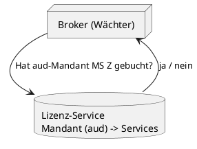
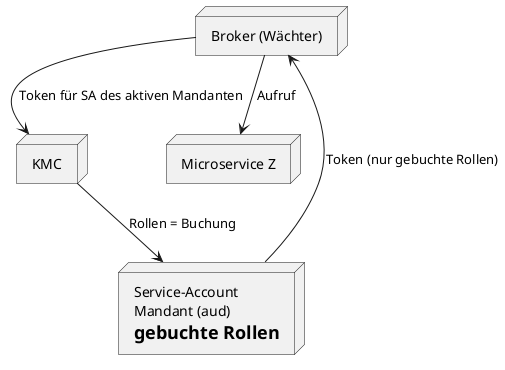
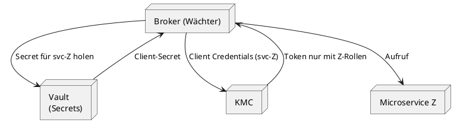
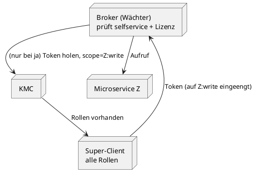
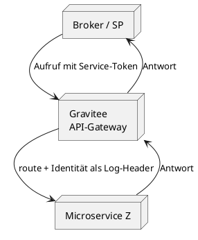
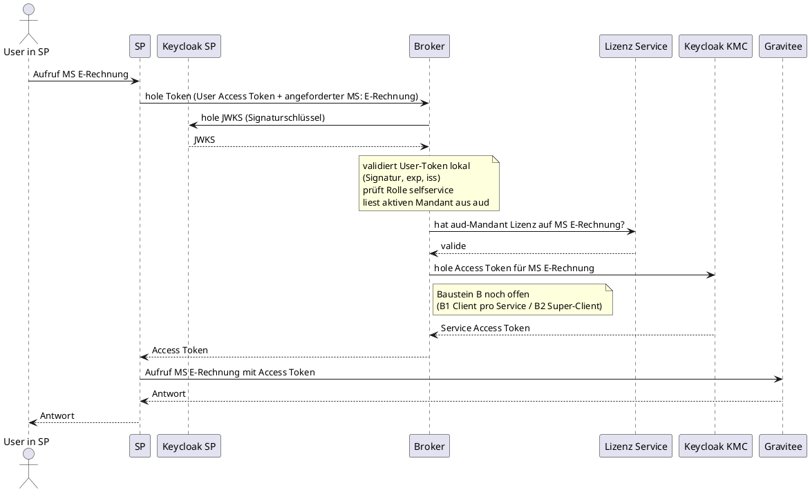
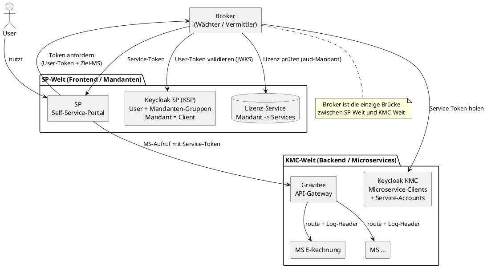

# Autorisierung im Mandantensystem – Referenzdokumentation

> **Archiv-Hinweis:** Dieses Dokument ist archivierter Produkt-Designraum, kein Lab-Stand. §7
> „Cross-Keycloak Token Exchange nicht umsetzbar" ist durch das inzwischen gebaute Lab **widerlegt**
> — siehe [`SETUP.md`](../../SETUP.md). Inhalte sonst unverändert.

> **Zweck dieses Dokuments:** Referenzdokumentation des Autorisierungs-Designs. Es beschreibt den festen Rahmen (Kontext, Token-Aufbau, Grundprinzipien) und die **Bausteine**, aus denen die konkrete Lösung zusammengesetzt wird. Die Bausteine sind nach Funktion gegliedert – nicht als flache Liste konkurrierender „Ansätze", sondern als kombinierbare Teile.

---

## 0. Was zur Entscheidung noch gebraucht wird

Der Lösungsraum ist vollständig beschrieben. Die noch offene Entscheidung (v. a. Wahrheitsquelle A1/A3/A2 und Token-Beschaffung B1/B2) hängt an **Anforderungen und Zahlen, die dieses Dokument nicht selbst liefern kann** und die vor der Entscheidungsrunde eingeholt werden sollten:

1. **Muss Abbuchen sofort wirken?** Wenn ein Mandant einen Service abbucht – muss der Zugriff _sofort_ enden, oder ist ein Nachlauf bis zum Token-Ablauf akzeptabel? (Geschäfts-/Compliance-Frage, oft an Bezahlung/Vertrag gekoppelt.) → entscheidet A1 vs. A3.
2. **Wie hoch ist die reale Änderungsfrequenz der Buchungen?** Selten (pro Mandant wenige Male im Jahr) oder häufig? → entscheidet, ob „Keycloak als Schreib-DB" (A2/A3) tragbar ist.
3. **Wie lang sind die Token-Laufzeiten?** Konkrete Zahl. → bestimmt bei A3, wie lange ein abgebuchter Service im Token weiterlebt.
4. **Gibt es harte Sicherheitsvorgaben zu Least-Privilege?** Ist ein Super-Client (B2) akzeptabel, oder ist Isolation pro Microservice (B1) Pflicht? (Security-/Governance-Entscheidung.)

Zusätzlich sollte **eine Person mit tiefem Keycloak-Wissen** die im Dokument als „setup-abhängig" / „versionsabhängig" markierten Annahmen bestätigen (siehe Abschnitt 6), idealerweise abgesichert durch einen kleinen **Proof of Concept** für die zwei kritischsten Punkte: Down-Scoping bei B2 und Admin-API-Last bei A2/A3.

> Sobald die vier Fragen beantwortet sind, führt die **Entscheidungsmatrix** (Abschnitt 5.1) direkt zu einer Baustein-Kombination.

---

## 1. Kontext

Zwei getrennte Keycloak-Welten, die überbrückt werden müssen:

- **KSP** (Keycloak SP, Frontend-Seite): kennt die **User** und deren **Mandanten-Zugehörigkeit**. Die Mandantisierung liegt vollständig hier. Jeder **Mandant ist als Client** definiert.
- **KMC** (Keycloak der Microservice-Seite, Backend): kennt nur die **Microservices als Clients** und deren Rollen. **Keine** Mandantisierung.

Weitere Randbedingungen:

- Vorne steht ein **User**, kein Service-Account. Der User existiert nur im KSP.
- Ein User kann in **mehreren Mandanten** Mitglied sein. Im Token ist jedoch immer nur **ein** Mandant _aktiv_.
- Microservices verlangen eigene Rollen (z. B. `read` / `write`). Diese Rollen gehören dem _Service-Account_ auf der KMC-Seite, **nicht** dem einzelnen User.
- **Skala:** ca. 1000 Mandanten. Buchen/Abbuchen von Services wird **automatisch über das Frontend** ausgelöst.
- **Keine** bestehende autoritative Quelle dafür, was ein Mandant gebucht hat – aktuell händisch gepflegt (wird durch dieses Design abgelöst).
- **Identitäts-Weitergabe** an den Microservice dient **nur dem Logging / der Nachvollziehbarkeit**, ist **nicht** autorisierungsrelevant. Der Microservice entscheidet allein anhand der Rollen im Service-Token.

> **Hinweis zu Unsicherheiten:** An mehreren Stellen hängt die Umsetzbarkeit von der konkreten Keycloak-Version ab (z. B. Down-Scoping beim Client-Credentials-Flow, Admin-API-Last bei Massen-Updates). Solche Punkte sind markiert und sollten vor der finalen Entscheidung mit einem kleinen Proof of Concept / Lasttest verifiziert werden.

---

## 2. Grundprinzipien

### 2.1 Token-Aufbau (KSP)

Das User-Token aus dem KSP trägt:

| Bestandteil             | Bedeutung                                                                                                                                                                                                                                      |
| ----------------------- | ---------------------------------------------------------------------------------------------------------------------------------------------------------------------------------------------------------------------------------------------- |
| Rolle `selfservice`     | **Binäres Gate.** Nur User mit dieser Rolle dürfen überhaupt einen Microservice aufrufen. Unterscheidet _nicht_ zwischen einzelnen Microservices.                                                                                              |
| Claim `domains` (Liste) | **Alle** Mandanten, für die der User berechtigt ist. Wird per **Mapper** serverseitig aus den Gruppen zusammengefasst (jede Mandanten-Gruppe trägt ein `domain`-Attribut = Mandanten-ID). Vom User **nicht** beeinflussbar → fälschungssicher. |
| Claim `aud`             | Der **aktuell aktive** Mandant. Da jeder Mandant ein Client ist, ist dies die Audience im OAuth-Sinn – das Token ist gezielt für **diesen einen** Mandanten-Client ausgestellt.                                                                |

### 2.2 Zwei Autorisierungsebenen

Die Autorisierung besteht aus zwei getrennten Fragen. Beide müssen mit „ja" beantwortet sein:

1. **Berechtigung (User-Ebene):** Hat der User die Rolle `selfservice`? → grobes Ja/Nein-Gate.
2. **Lizenz (Mandanten-Ebene):** Hat der aktive Mandant (aus `aud`) den angeforderten Microservice gebucht? → die eigentliche Feinsteuerung.

**Bewusste Design-Entscheidung:** Es gibt **keine** feingranulare Rechtevergabe _pro User innerhalb eines Mandanten_. Jeder `selfservice`-User desselben Mandanten hat identische Rechte – er darf alle Microservices nutzen, die der Mandant gebucht hat. Die Feinsteuerung, _welche_ MS, kommt allein aus der Lizenz, nicht aus der User-Ebene.

### 2.3 Mandantenwechsel

Der aktive Mandant wird per **internem Token Exchange innerhalb des KSP** gewechselt: Der User tauscht sein Token gegen eines mit anderer Audience (`aud`). Da jeder Mandant ein Client ist, ist das ein regulärer Audience-Wechsel – nach dem Wechsel von Mandant A zu B ist das Token nur noch für Mandant B gültig. Keycloak stellt dabei sicher, dass nur auf einen Mandanten gewechselt werden kann, für den der User berechtigt ist.

> **Abgrenzung:** Dieser _interne_ Token Exchange (innerhalb des KSP, bekannter Prinzipal auf beiden Seiten) ist valide und Teil der Lösung. Er ist **nicht** zu verwechseln mit einem _cross-Keycloak_ Token Exchange zwischen KSP und KMC – dieser ist nicht umsetzbar (siehe Abschnitt „Verworfene Ansätze").

> **Neutrale Notiz:** Der Broker kann defensiv zusätzlich prüfen, dass `aud` in der `domains`-Liste enthalten ist. Da der Wechsel bereits über den internen Token Exchange abgesichert ist, ist dies eine redundante Zusatzprüfung, die den Broker unabhängig von der KSP-Konfiguration robust hält.

### 2.4 Die Rolle des Brokers (Wächter)

Der **Broker** ist die zentrale, serverseitige Komponente, die beide Keycloak-Welten verbindet. Er ist als **eigenständiger Dienst** konzipiert (nicht Teil des Browsers, nicht Teil des SP-Frontends). Sein Ablauf pro Request:

1. User-Token validieren (Signatur, `exp`, `iss`) – lokal via JWKS.
2. Prüfen: Rolle `selfservice` vorhanden? → sonst Abbruch.
3. Aktiven Mandanten aus `aud` lesen.
4. **Lizenz prüfen** (Wahrheitsquelle, siehe Baustein A): Hat dieser Mandant den MS gebucht?
5. Nur bei „ja": **Service-Token beschaffen** (siehe Baustein B) und Aufruf via Gateway.

---

## 3. Bausteine

Die Lösung entsteht durch Kombination von Bausteinen aus zwei Achsen, plus einem optionalen Durchsetzungspunkt:

- **Baustein A – Wahrheitsquelle:** Woher weiß das System, was ein Mandant gebucht hat? (Lizenz)
- **Baustein B – Token-Beschaffung:** Wie kommt der Broker an ein Microservice-Token auf der KMC-Seite?
- **Baustein C – Durchsetzung:** Wo werden Aufruf und Identitäts-Weitergabe zentralisiert? (Gateway)

Man wählt **eine** Variante aus A und **eine** aus B (Ausnahme: A-Variante „Account pro Mandant" deckt B mit ab). C ist optional und liegt quer zu beidem.

| Baustein | Variante                             | Deckt Lizenz ab? | Deckt Token-Beschaffung ab? | Steht allein?             |
| -------- | ------------------------------------ | ---------------- | --------------------------- | ------------------------- |
| A        | A1 – Lizenz-Service                  | ✅               | ❌                          | Nein – braucht ein B      |
| A        | A2 – Account pro Mandant             | ✅               | ✅                          | **Ja**                    |
| A        | A3 – Entitlement-Attribut im Token   | ✅               | ❌                          | Nein – braucht ein B      |
| B        | B1 – Client pro Microservice + Vault | ❌               | ✅                          | Nein – braucht ein A      |
| B        | B2 – Super-Client + Down-Scoping     | ❌               | ✅                          | Nein – braucht ein A      |
| C        | C1 – API-Gateway (Gravitee)          | ❌               | (teilweise)                 | Nein – Durchsetzungspunkt |

---

## Baustein A – Wahrheitsquelle (Lizenz)

### A1 – Dedizierter Lizenz-Service

**Beschreibung.** Die Buchungswahrheit („welcher Mandant hat welche Services gebucht") lebt als **Anwendungsdaten** in einem eigenen **Lizenz-Service** – bewusst _außerhalb_ von Keycloak. Das Frontend schreibt beim Buchen/Abbuchen dorthin. Der Broker fragt den Lizenz-Service pro Request. Keycloak bleibt zuständig für Identität und Token-Ausstellung, nicht für den Buchungszustand.

**Diagramm.**



**Pro**

- Buchungszustand liegt dort, wo er hingehört: hochfrequente, UI-getriebene Anwendungsdaten in einer Datenbank.
- Skaliert sauber auf 1000+ Mandanten; Buchen/Abbuchen ist ein simpler DB-Schreibvorgang.
- Klare Trennung von Lizenz (ändert sich mit Vertrag) und Identität (Keycloak) – unabhängig pflegbar.
- Keycloak wird nicht zur Datenbank für sich ständig ändernde Zustände zweckentfremdet.

**Contra**

- Eigene Datenhaltung + Logik, die gebaut und gepflegt werden muss.
- Buchungswahrheit liegt außerhalb von Keycloak – kann organisatorisch als „nicht Keycloak-zentrisch" hinterfragt werden.
- Braucht einen Baustein B für die eigentliche Token-Beschaffung.

### A2 – Service-Account pro Mandant

**Beschreibung.** Pro Mandant gibt es auf der KMC-Seite einen Service-Account, der genau die Rollen trägt, die _sein Mandant gebucht hat_. Der Broker holt sich für den aktiven Mandanten dessen Token und erhält damit automatisch nur die gebuchten Rollen. Die Lizenz ist so **in Keycloak eingebacken** – man kann keine Rolle bekommen, die der Mandant nicht hat. Buchen/Abbuchen = Rollen des Mandanten-Accounts per Admin-API ändern.

**Diagramm.**



> **Wichtig:** A2 deckt nur die **Lizenz** ab. Die **User-Berechtigung** (`selfservice`-Gate) muss **trotzdem** vorher im Broker geprüft werden – der Mandanten-Account allein würde sonst jedem User des Mandanten alles erlauben.

**Pro**

- Lizenz ist unfälschbar im Token abgebildet: fehlt die Buchung, fehlt die Rolle.
- „Aus Versehen auf falschen Mandanten schalten" ist strukturell ausgeschlossen.
- Deckt Achse A **und** B in einem ab – kein separater Baustein B nötig.

**Contra**

- **~1000 Service-Accounts**, die angelegt, gepflegt und deren Secrets rotiert werden müssen.
- Buchen/Abbuchen = Schreibvorgang auf Keycloak-Rollen via Admin-API → koppelt den Buchungsprozess eng an Keycloak-Administration.
- Hochfrequenter, UI-getriebener Buchungszustand wird in Keycloak-Rollen geführt – Keycloak als Zustandsdatenbank zweckentfremdet.
- ⚠️ Admin-API-Last bei Massen-Updates und Token-Ausstellung für 1000 Accounts unbedingt vorab per Lasttest prüfen.

### A3 – Entitlement-Attribut im Token

**Beschreibung.** Die Buchungswahrheit lebt als **Attribut `entitlement`** direkt an der Mandanten-Gruppe im **KSP** – dort, wo die Mandanten-Zugehörigkeit ohnehin liegt. Das Attribut enthält die Liste der gebuchten Services des Mandanten. Ein **Mapper** zieht es (wie bereits `domains`) fälschungssicher ins User-Token. Der Broker prüft dann nur noch, ob der angeforderte Microservice im `entitlement`-Claim enthalten ist – **kein externer Service-Call**, die Lizenz reist im Token mit. Buchen/Abbuchen ändert das Gruppen-Attribut per Keycloak-Admin-API.

**Diagramm.**

```plantuml
@startuml
skinparam componentStyle rectangle
skinparam shadowing false

node "KSP\nMandanten-Gruppe\nattribut: entitlement" as KSP
node "Broker (Wächter)" as B

KSP --> B : Token mit entitlement-Claim\n(gebuchte Services des Mandanten)
note over B : prüft: angeforderter MS\nin entitlement enthalten?\n(kein externer Call)
@enduml
```

**Pro**

- Fügt sich in die **bestehende** Mapper-/Gruppen-Mechanik des KSP ein – kein neuer Dienst, keine 1000 Service-Accounts.
- Lizenz reist im Token mit → **ein** Prüfschritt im Broker, kein Roundtrip zu einem externen Lizenz-Service.
- Fälschungssicher wie `domains`, da serverseitig aus dem Gruppen-Attribut gemappt.

**Contra**

- **Token-Latenz beim Abbuchen:** Das `entitlement` reist im Token mit; bereits ausgestellte Tokens tragen das alte Entitlement bis zum Ablauf weiter. Ein _abgebuchter_ Service bleibt bis zum Token-Ablauf nutzbar. Bei A1 (Lizenz-Service, pro Request gefragt) wirkt Abbuchen dagegen **sofort**. → relevant, wenn Abbuchen zeitnah/vertraglich greifen muss.
- Buchen/Abbuchen = Schreibvorgang auf ein Keycloak-Gruppen-Attribut via Admin-API → **Keycloak wird zur Schreib-DB für hochfrequente, UI-getriebene Buchungsdaten** (dieselbe Zweckentfremdung wie bei A2, nur per Attribut statt Rollen).
- Deckt **nur Achse A** ab – die Token-Beschaffung (Baustein B) bleibt weiterhin offen und muss separat gewählt werden.

> **Einordnung (Meinung):** Für dieses konkrete Setup der **eleganteste** der drei A-Varianten, weil er sich nahtlos in die vorhandene Struktur einfügt und die 1000 Service-Accounts vermeidet. Aber **kein automatischer Gewinner** gegenüber A1: A3 gewinnt bei Einfachheit, A1 bei Aktualität (sofortiges Abbuchen) und dabei, Keycloak nicht zur Buchungs-Schreib-DB zu machen. Die Wahl A3 vs. A1 hängt an zwei fachlich zu klärenden Fragen: (1) Wie schnell muss Abbuchen wirken? (2) Wie hoch ist die reale Änderungsfrequenz der Buchungen?

---

## Baustein B – Token-Beschaffung

> Bausteine B stehen **nie allein**: Sie beschaffen nur das Token, wissen aber nichts über Buchungen. Die Lizenzentscheidung kommt aus Baustein A und wird vom Broker **vor** der Token-Beschaffung geprüft. (Entfällt nur, wenn als A die Variante A2 gewählt wird, die B mit abdeckt.)

### B1 – Ein Client pro Microservice + Vault

**Beschreibung.** Pro Microservice gibt es auf der KMC-Seite **einen eigenen Service-Account-Client**, der genau die Rollen _seines_ Ziel-Microservice trägt. Die Credentials liegen in einem **Secret-Store** (Vault, Kubernetes Secrets o. ä.), nicht im Broker-Code. Der Broker leitet den passenden Account idealerweise per **Namenskonvention** ab (z. B. Client-ID = `svc-<microservice>`), sodass neue Microservices ohne Code-Änderung funktionieren.

**Diagramm.**



**Pro**

- Least Privilege pro Microservice: ein geleaktes Secret öffnet nur _einen_ Service.
- Kein Hardcoding von Credentials; Rotation über den Secret-Store.
- Namenskonvention vermeidet eine manuell gepflegte Liste.

**Contra**

- Jeder Service-Account muss angelegt werden (auch wenn nicht im Code bekannt).
- Mehr bewegliche Teile: N Accounts, N Secrets, Rotationsprozess.
- ⚠️ Bei sehr vielen Microservices: Betriebsaufwand für Anlage/Rotation nicht unterschätzen.

### B2 – Super-Client mit Down-Scoping

**Beschreibung.** Ein **einziger** Client (ein Secret) trägt alle relevanten Microservice-Rollen. Der Broker holt dessen Token und schränkt es pro Request per Scope/Audience auf den Ziel-Microservice und die nötige Rolle ein. Der Super-Client ist ein _kontrollierter Generalschlüssel_, der nie ohne vorherige Lizenz-/Berechtigungsprüfung benutzt wird.

**Diagramm.**



**Pro**

- Technisch am einfachsten: ein Client, ein Secret, keine 1000 Accounts.
- Neue Microservices erfordern nur eine Rollen-Ergänzung am Super-Client.
- Wenig Betriebsaufwand bei der Secret-Verwaltung.

**Contra**

- Der Super-Client „kann alles" – ein geleaktes Secret öffnet **jeden** Microservice.
- „Secure by discipline": Sicherheit hängt daran, dass der Broker **vor jeder** Nutzung korrekt prüft – ein vergessener Check ist potenziell fatal (anders als bei A2, das „secure by construction" ist).
- Widerspricht Least-Privilege; bei Microservice-Teams oft unbeliebt.
- ⚠️ Setzt voraus, dass Keycloak das per-Request-Down-Scoping beim Client-Credentials-Flow sauber unterstützt – **versionsabhängig, vorab per PoC verifizieren.**

---

## Baustein C – Durchsetzung (API-Gateway / Gravitee)

**Beschreibung.** Ein API-Gateway (Gravitee) sitzt vor den Microservices und ist der zentrale Durchsetzungspunkt: Es nimmt den Aufruf mit dem Service-Token entgegen, validiert es und reicht die User-Identität als **Log-Kontext** an den Microservice weiter. Statt dass jeder Microservice die Identitäts-Weitergabe selbst behandelt, ist das Gateway die eine vertrauenswürdige Stelle. Das Gateway ist **nicht** die Wahrheitsquelle – es liegt quer zu A und B.

**Diagramm.**



**Pro**

- Zentraler, einheitlicher Ort für Token-Validierung und Identitäts-Weitergabe – nicht in jedem Microservice dupliziert.
- Natürliche Stelle, um den Log-Header nur intern zu akzeptieren (Microservices nur hinter dem Gateway erreichbar).
- Entlastet einzelne Microservices; saubere Trennung von Fachlogik und Cross-Cutting-Concerns.

**Contra**

- Zusätzliche Infrastruktur-Komponente (Betrieb, Verfügbarkeit, Redundanz).
- Löst die Wahrheitsfrage **nicht** – braucht weiterhin ein A dahinter.

---

## 4. Referenz-Architektur (konkretes Setup)

Die konkret vorgesehene Zusammensetzung für dieses System. Komponenten: **SP** (Self-Service-Portal / Frontend), **KSP** (Keycloak SP), **Broker** (Wächter), **Lizenz-Service**, **KMC** (Keycloak Microservice-Seite), **Gravitee** (API-Gateway).

> **Gewählte Bausteine:** Wahrheitsquelle noch **offen** – A1 (Lizenz-Service) oder A3 (Entitlement-Attribut); Entscheidung hängt an Abbuch-Sofortwirkung und Änderungsfrequenz (fachlich zu klären). Baustein B (Token-Beschaffung) ebenfalls **offen** – B1 oder B2. C1 (Gravitee) als Durchsetzung. Das folgende Sequenzdiagramm zeigt die A1-Variante (externer Lizenz-Service-Call); bei A3 entfällt dieser Call, stattdessen prüft der Broker den `entitlement`-Claim direkt im Token.

### 4.1 Ablauf (Sequenzdiagramm)



### 4.2 Komponenten im Zusammenspiel

Statische Sicht. Die zwei Packages sind die getrennten Keycloak-Welten; der Broker ist die einzige Brücke.



### 4.3 Offene Punkte im konkreten Setup

- **Baustein B noch offen:** B1 (Client pro Microservice + Vault) oder B2 (Super-Client). Entscheidung abhängig von Least-Privilege-Anspruch vs. Betriebsaufwand.
- **Identitäts-Weitergabe fürs Logging:** Der Log-Header (User + aktiver Mandant) sollte über Gravitee an die Microservices durchgereicht werden. Format/Signierung noch festzulegen.
- **Token-Rückgabe an SP:** Aktuell erhält SP das Service-Token und ruft Gravitee selbst auf. Ob das Service-Token zurück ans Frontend gegeben wird, ist ein bewusst zu treffender Sicherheits-Trade-off (abhängig davon, ob SP serverseitig oder im Browser läuft). Alternative: Der Broker/Gateway ruft den MS serverseitig auf.

---

## 5. Kurzvergleich der Bausteine

| Baustein                             | Wo liegt die Buchungswahrheit? | Anzahl Accounts | Least Privilege     | Hauptrisiko                                        |
| ------------------------------------ | ------------------------------ | --------------- | ------------------- | -------------------------------------------------- |
| A1 – Lizenz-Service                  | Eigene DB (außerhalb KC)       | –               | –                   | Wird als „nicht KC-zentrisch" hinterfragt          |
| A2 – Account pro Mandant             | Keycloak-Rollen                | ~1000           | hoch                | Admin-API-Last, KC als Zustands-DB                 |
| A3 – Entitlement-Attribut            | KSP-Gruppenattribut (im Token) | –               | –                   | Abbuchen erst nach Token-Ablauf; KC als Schreib-DB |
| B1 – Client pro Microservice + Vault | (aus A)                        | N (= Services)  | hoch                | Betriebsaufwand N Accounts/Secrets                 |
| B2 – Super-Client                    | (aus A)                        | 1               | niedrig             | Ein Secret öffnet alles                            |
| C1 – API-Gateway                     | (aus A)                        | –               | je nach Kombination | Zusätzliche Infra, löst Wahrheit nicht             |

### 5.1 Entscheidungsmatrix

Sobald die vier Fragen aus Abschnitt 0 beantwortet sind, führt diese Matrix zu einer Baustein-Kombination.

**Wahrheitsquelle (Achse A):**

| Wenn …                                                                                       | dann                          | weil                                                        |
| -------------------------------------------------------------------------------------------- | ----------------------------- | ----------------------------------------------------------- |
| Abbuchen muss **sofort** wirken (Compliance/Bezahlung)                                       | **A1** (Lizenz-Service)       | pro Request gefragt → keine Token-Latenz                    |
| Abbuchen-Nachlauf bis Token-Ablauf ist **ok** **und** Änderungen eher selten                 | **A3** (Entitlement im Token) | fügt sich in bestehende Mapper-Struktur, kein externer Call |
| „Alles muss über Keycloak-Rollen laufen" ist harte Vorgabe **und** Account-Zahl beherrschbar | **A2** (Account pro Mandant)  | secure by construction, deckt B mit ab                      |
| Buchungen ändern sich **häufig** (hohe Schreiblast)                                          | **A1** (nicht A2/A3)          | Keycloak nicht als Schreib-DB für hochfrequente Daten       |

**Token-Beschaffung (Achse B) – entfällt bei A2:**

| Wenn …                                                          | dann                             | weil                                          |
| --------------------------------------------------------------- | -------------------------------- | --------------------------------------------- |
| Least-Privilege ist **Pflicht** (Security-Vorgabe)              | **B1** (Client pro Microservice) | ein geleaktes Secret öffnet nur einen Service |
| Betriebsaufwand minimieren, Super-Client akzeptiert             | **B2** (Super-Client)            | ein Secret, kein Account-Wildwuchs            |
| Down-Scoping in der Keycloak-Version **nicht** sauber verfügbar | **B1** (nicht B2)                | B2 setzt zuverlässiges Down-Scoping voraus    |

**Durchsetzung (C):** Gravitee ist gesetzt (bereits in der Landschaft) → **C1** in allen Kombinationen.

**Typische resultierende Kombinationen:**

- **A1 + B1 + C1** – maximale Sauberkeit/Aktualität, höchster Betriebsaufwand.
- **A1 + B2 + C1** – sofortiges Abbuchen, schlanke Token-Beschaffung, Super-Client-Risiko.
- **A3 + B2 + C1** – schlankste Variante, wenn Abbuch-Nachlauf ok; alles im Token, ein Client.
- **A2 + C1** – nur wenn „alles über Keycloak" Vorgabe ist und die Account-Zahl akzeptiert wird.

> Die Matrix ersetzt keine fachliche Abwägung – sie macht nur sichtbar, welche Antwort auf die vier Fragen zu welcher Kombination führt. Bei Zielkonflikten (z. B. „sofortiges Abbuchen" **und** „häufige Änderungen" → beide zeigen auf A1, konsistent; aber „alles über Keycloak" **und** „sofortiges Abbuchen" → Konflikt A2 vs. A1, der bewusst entschieden werden muss).

---

## 6. Offene Punkte / vor Entscheidung zu klären

- **Wahrheitsquelle-Wahl (A1 vs. A3 vs. A2):** Kernentscheidung. A1 (Lizenz-Service, Abbuchen sofort wirksam, externer Call) vs. A3 (Entitlement im Token, keine externe Abfrage, aber Abbuchen erst nach Token-Ablauf) vs. A2 (1000 Accounts). Hängt an: Wie schnell muss Abbuchen wirken? Wie hoch ist die reale Änderungsfrequenz? → **fachlich zu klären.**
- **Token-Laufzeiten** (relevant für A3): Bestimmen, wie lange ein abgebuchter Service im Token weiterlebt.
- **Baustein-B-Wahl (B1 vs. B2):** Least-Privilege vs. Betriebsaufwand.
- **Keycloak-Version:** Unterstützt sie per-Request-Down-Scoping (für B2) zuverlässig? → kleiner PoC.
- **Lasttest** falls A2 erwogen wird (1000 Accounts, Massen-Rollen-Updates, Token-Ausstellungsrate).
- **Abbuchen-Flow:** Der genaue UI-getriggerte Abbuchungsvorgang ist noch nicht spezifiziert – beeinflusst v. a. A2 (Rollen entfernen) vs. A1 (DB-Update).
- **Log-Header-Format** und dessen interne Akzeptanz (nur hinter dem Gateway).

---

## 7. Verworfene Ansätze

Geprüft und **nicht** tragfähig – hier dokumentiert, damit die Gründe nachvollziehbar sind und die Diskussion nicht erneut aufkommt.

### Cross-Keycloak Token Exchange (KSP → KMC)

Ein Token Exchange, der das User-Token über die Grenze zwischen KSP und KMC tauscht, ist **nicht** umsetzbar: Der KMC kennt weder den User noch die Mandanten. Es gibt drüben keinen Prinzipal, gegen den getauscht werden könnte. Alles nach hinten zu spiegeln (User + 1000 Mandanten synchron in beiden Keycloaks) wäre ein Wartungsalbtraum und eine Quelle für Drift.

> **Abgrenzung:** Der _interne_ Token Exchange **innerhalb des KSP** für den Mandantenwechsel (Abschnitt 2.3) ist davon unberührt und valide – dort existiert der Prinzipal auf beiden Seiten.

### Token-Exchange-Chaining über die Grenze

Setzt einen durchgehend bekannten Prinzipal über alle Hops voraus. Bricht an derselben Grenze wie oben und an der fehlenden Mandantisierung im KMC.

### Rollen direkt im gescopten User-Token (statt Service-Account)

Würde erfordern, dass das an den Microservice gereichte Token die `read`/`write`-Rollen direkt trägt. Scheitert an der Realm-Grenze (der KMC kennt den User nicht) und würde die Microservice-Rollen wieder an den User koppeln – genau das, was vermieden werden soll.

### Optional erwägenswert (nicht verworfen, aber bewusst zurückgestellt)

- **Gespiegelte Mandanten im KMC + Token Exchange:** Technisch möglich, aber erkauft mit der Synchronisation von 1000 Mandanten über zwei Keycloaks – und löst die Lizenzfrage trotzdem nicht separat. Als teurerer Umweg zu A1/A2 zurückgestellt; für spätere Diskussion notiert.
